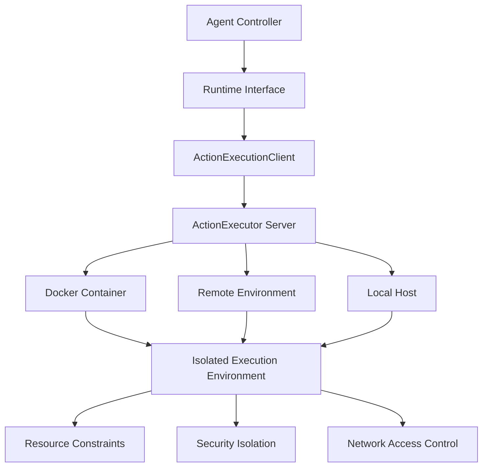
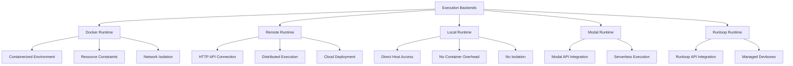
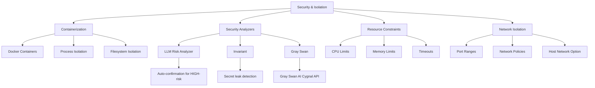
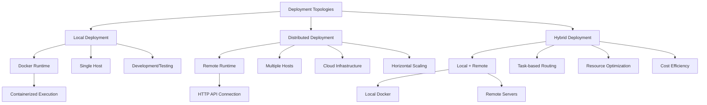
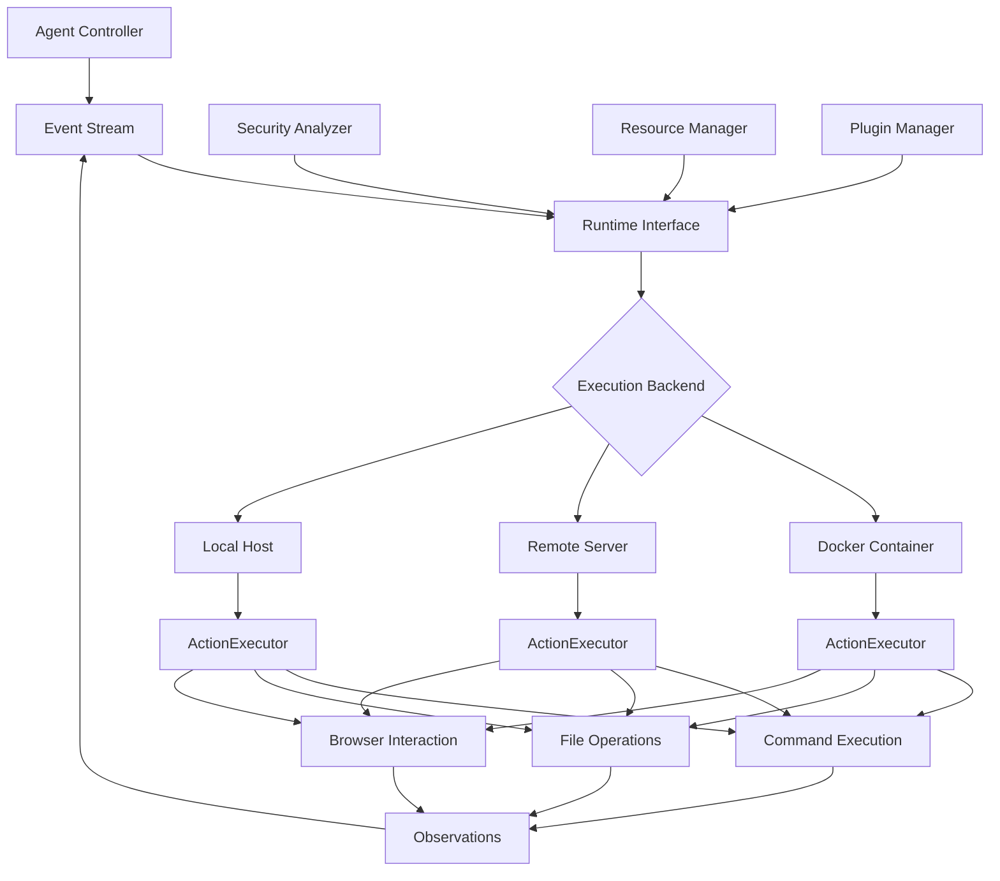

# Runtime & Execution Environment

<cite>
**Referenced Files in This Document**   
- [base.py](file://openhands/runtime/base.py)
- [action_execution_client.py](file://openhands/runtime/impl/action_execution/action_execution_client.py)
- [docker_runtime.py](file://openhands/runtime/impl/docker/docker_runtime.py)
- [sandbox_config.py](file://openhands/core/config/sandbox_config.py)
- [README.md](file://openhands/runtime/README.md)
- [security/README.md](file://openhands/security/README.md)
- [app_server/sandbox/README.md](file://openhands/app_server/sandbox/README.md)
- [containers/runtime/README.md](file://containers/runtime/README.md)
</cite>

## Table of Contents
1. [Introduction](#introduction)
2. [Architecture Overview](#architecture-overview)
3. [Core Components](#core-components)
4. [Execution Backends](#execution-backends)
5. [Resource Management](#resource-management)
6. [Security and Isolation](#security-and-isolation)
7. [Infrastructure Requirements](#infrastructure-requirements)
8. [Deployment Topology](#deployment-topology)
9. [Technology Stack](#technology-stack)
10. [System Context](#system-context)

## Introduction

The Runtime & Execution Environment component in OpenHands provides a secure and isolated execution environment for agent actions. This architecture enables safe code execution through containerization and sandboxing techniques, allowing agents to perform complex tasks while maintaining system security and integrity. The runtime system supports multiple execution backends, including Docker, remote execution services, and local runtime options, providing flexibility for different deployment scenarios and use cases.

The runtime environment serves as the primary interface between the agent and the external environment, handling various operations such as bash command execution, file system operations, web browsing, and environment variable management. It ensures that all agent actions are executed in a controlled and monitored environment, with proper isolation and resource constraints.

**Section sources**
- [README.md](file://openhands/runtime/README.md#L1-L162)

## Architecture Overview

The Runtime & Execution Environment architecture follows a modular design with a clear separation between the runtime controller, sandbox environments, and agent actions. The system is built around the Runtime class, which serves as the primary interface for agent interactions with the external environment. This class handles various operations including bash sandbox execution, browser interactions, filesystem operations, and environment variable management.

The architecture implements a client-server model where the ActionExecutionClient interacts with an ActionExecutor server via HTTP calls to perform runtime actions. This design enables both local and remote execution capabilities, with the same interface used regardless of the underlying execution backend. The runtime system is responsible for initializing the user environment, managing plugins, and executing various action types received from the agent.

**Diagram sources**
- [base.py](file://openhands/runtime/base.py#L1-L1206)
- [action_execution_client.py](file://openhands/runtime/impl/action_execution/action_execution_client.py#L1-L494)

## Core Components

The Runtime & Execution Environment consists of several core components that work together to provide a secure and efficient execution environment. The Runtime class serves as the primary interface for agent interactions, handling various operations such as bash command execution, file system operations, and environment variable management. This class is initialized with configuration and event stream parameters and provides asynchronous initialization for setting up environment variables.

The ActionExecutionClient class implements the Runtime interface and contains shared logic for interacting with the ActionExecutor server. It handles HTTP communication with the execution server, manages file operations through upload and download endpoints, and processes various action types. The client uses a semaphore to ensure that only one action is executed at a time, maintaining consistency and preventing race conditions.

The ActionExecutor server runs within the sandbox environment and is responsible for executing actions received via the /execute_action HTTP endpoint. It initializes the user environment and bash shell, manages plugins, and executes various action types including bash commands, IPython cells, file operations, and browsing actions. The server returns observations in the HTTP response, which are then processed by the client and added to the event stream.

**Section sources**
- [base.py](file://openhands/runtime/base.py#L1-L1206)
- [action_execution_client.py](file://openhands/runtime/impl/action_execution/action_execution_client.py#L1-L494)

## Execution Backends

OpenHands supports multiple execution backends to accommodate different deployment scenarios and requirements. The primary execution backend is Docker, which creates and manages a Docker container for each session, executing actions within the container for security and isolation. This backend supports direct file system access and local resource management, making it ideal for development, testing, and scenarios requiring full control over the execution environment.

The Remote Runtime connects to a remote server running the ActionExecutor, enabling distributed execution and cloud-based deployments. This backend is designed for production environments, scalability, and scenarios where local resource constraints are a concern. It supports parallel evaluation and can be used with various remote execution services like Modal and Runloop.

The Local Runtime runs the ActionExecutor directly on the host machine without containerization. While this provides the fastest execution speed and minimal setup requirements, it offers no isolation and runs with the same permissions as the user running OpenHands. This backend is primarily intended for development and testing when Docker is not available or desired.

**Diagram sources**
- [README.md](file://openhands/runtime/README.md#L104-L153)
- [docker_runtime.py](file://openhands/runtime/impl/docker/docker_runtime.py#L1-L765)

## Resource Management

The Runtime & Execution Environment implements comprehensive resource management to ensure efficient and safe execution of agent actions. Resource constraints are configured through the SandboxConfig class, which defines parameters for CPU, memory, and network usage. The system supports Docker resource limits including CPU period and quota, memory limits, and swap configuration to prevent resource exhaustion.

The runtime environment manages port allocation through dedicated port ranges for different services, preventing port conflicts and ensuring consistent network access. Four port ranges are defined: EXECUTION_SERVER_PORT_RANGE (30000-39999) for the action execution server, VSCODE_PORT_RANGE (40000-49999) for VSCode integration, and two application port ranges (50000-54999 and 55000-59999) for application services. On Windows and WSL2 systems, these ranges are adjusted to avoid conflicts with system ports.

Resource monitoring is implemented through the system_stats module, which tracks execution times and resource usage. The runtime can be configured with timeouts for action execution, preventing infinite loops or long-running processes from consuming excessive resources. Memory limits can be set both at the Docker level (mem_limit) and through environment variables (RUNTIME_MAX_MEMORY_GB), providing multiple layers of protection against memory exhaustion.

**Section sources**
- [docker_runtime.py](file://openhands/runtime/impl/docker/docker_runtime.py#L1-L200)
- [sandbox_config.py](file://openhands/core/config/sandbox_config.py#L1-L27)

## Security and Isolation

The Runtime & Execution Environment implements multiple layers of security and isolation to protect the host system and ensure safe agent execution. The primary security mechanism is containerization through Docker, which provides process and filesystem isolation, preventing agent actions from directly accessing the host system. Each agent session runs in its own container with restricted permissions and resource limits.

The security framework includes the SecurityAnalyzer class, which monitors and analyzes agent actions for potential security risks. Multiple security analyzers are available, including the LLM Risk Analyzer (default), Invariant, and Gray Swan. These analyzers evaluate actions for security risks and can require user confirmation before executing potentially dangerous operations. The LLM Risk Analyzer uses LLM-provided risk assessments to automatically require confirmation for HIGH-risk actions while respecting confirmation mode settings for MEDIUM and LOW-risk actions.

Additional security features include environment variable isolation, where environment variables are explicitly passed to the sandbox environment rather than inheriting all host variables. The system also supports read-only volume mounts (specified with :ro suffix) to prevent modification of sensitive files. For Windows and WSL2 environments, special port ranges are used to avoid conflicts with system services.

**Diagram sources**
- [security/README.md](file://openhands/security/README.md#L1-L130)
- [docker_runtime.py](file://openhands/runtime/impl/docker/docker_runtime.py#L1-L200)

## Infrastructure Requirements

The Runtime & Execution Environment has specific infrastructure requirements that vary depending on the chosen execution backend. For the Docker Runtime, the primary requirement is a functioning Docker installation with access to the Docker daemon through /var/run/docker.sock. The system must have sufficient CPU and memory resources to support containerized execution, with recommended minimum specifications of 4 CPU cores and 8GB RAM for optimal performance.

For GPU support, the system requires NVIDIA Docker (nvidia-docker) and appropriate GPU drivers. When GPU support is enabled, the SANDBOX_ENABLE_GPU environment variable is set to true, and the --gpus all flag is passed to the Docker runtime. This allows agents to leverage GPU acceleration for machine learning and other compute-intensive tasks.

Storage requirements include space for Docker images, container layers, and workspace data. The system uses volume mounts to connect the host filesystem to the container, with the default workspace mounted at /workspace. Additional storage may be required for logging and monitoring data, especially when DEBUG_RUNTIME mode is enabled.

Network requirements include outbound internet access for downloading dependencies and accessing remote services. The system can be configured to use host networking (use_host_network = True) when needed for specific applications, though this reduces network isolation. Additional Docker networks can be specified through the additional_networks configuration parameter.

**Section sources**
- [gui_launcher.py](file://openhands/cli/gui_launcher.py#L123-L165)
- [sandbox_config.py](file://openhands/core/config/sandbox_config.py#L1-L27)

## Deployment Topology

The Runtime & Execution Environment supports multiple deployment topologies to accommodate different use cases and scalability requirements. The default deployment uses the Docker Runtime with local execution, where each agent session runs in its own Docker container on the same host as the OpenHands application. This topology is ideal for development, testing, and single-user scenarios, providing good isolation with minimal infrastructure requirements.

For production and multi-user environments, a distributed deployment topology can be used with the Remote Runtime. In this configuration, the OpenHands application runs on a central server while agent execution occurs on remote hosts or cloud infrastructure. This enables horizontal scaling, load balancing, and resource optimization across multiple execution nodes. The Remote Runtime connects to execution servers via HTTP API, allowing for flexible deployment across different cloud providers and infrastructure.

A hybrid deployment topology combines local and remote execution, where certain agent types or tasks are routed to specific execution backends based on requirements. For example, CPU-intensive tasks might be directed to remote GPU-enabled servers, while simple tasks are handled locally. This approach optimizes resource utilization and cost efficiency.

**Diagram sources**
- [README.md](file://openhands/runtime/README.md#L104-L153)
- [app_server/sandbox/README.md](file://openhands/app_server/sandbox/README.md#L1-L22)

## Technology Stack

The Runtime & Execution Environment leverages a comprehensive technology stack to provide secure and efficient agent execution. At the core is Docker, which provides containerization and isolation for agent actions. The system uses Docker images based on configurable base images, with the default being nikolaik/python-nodejs:python3.12-nodejs22, providing a rich environment with Python, Node.js, and common development tools.

The execution environment is built around a client-server architecture using HTTP/HTTPS for communication between the ActionExecutionClient and ActionExecutor server. The system uses httpx for HTTP requests with retry logic implemented through the tenacity library, ensuring reliable communication even in unstable network conditions.

For local execution, the system integrates with the host Docker daemon through the docker-py library, allowing programmatic control of containers, images, and networks. Remote execution is supported through custom HTTP APIs, with integrations available for services like Modal and Runloop that provide serverless and managed execution environments.

The technology stack also includes support for various plugins and extensions, such as Jupyter for interactive computing, VSCode for code editing, and AgentSkills for enhanced capabilities. These plugins are initialized and managed by the runtime system, providing a consistent interface regardless of the underlying execution backend.

**Section sources**
- [README.md](file://openhands/runtime/README.md#L1-L162)
- [containers/runtime/README.md](file://containers/runtime/README.md#L1-L13)

## System Context

The Runtime & Execution Environment serves as the bridge between agent actions and execution environments, providing a secure and controlled interface for agent operations. The system context diagram illustrates the relationship between the agent controller, runtime components, and various execution backends.

Agent actions originate from the agent controller, which sends commands through the event stream to the Runtime interface. The Runtime routes these actions to the appropriate execution backend based on configuration. For Docker execution, actions are processed by the ActionExecutor running in a container. For remote execution, actions are sent via HTTP API to remote servers. For local execution, actions run directly on the host system.

The runtime environment manages the lifecycle of execution environments, including creation, initialization, and destruction. It handles file operations through upload and download mechanisms, environment variable management, and plugin initialization. The system also manages network access, port allocation, and resource constraints to ensure stable and secure execution.

**Diagram sources**
- [base.py](file://openhands/runtime/base.py#L1-L1206)
- [action_execution_client.py](file://openhands/runtime/impl/action_execution/action_execution_client.py#L1-L494)
- [app_server/sandbox/README.md](file://openhands/app_server/sandbox/README.md#L1-L22)