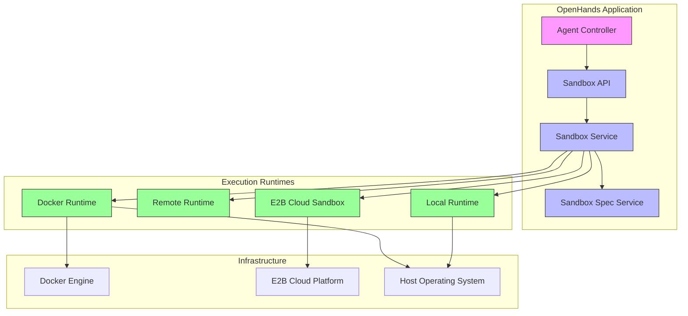
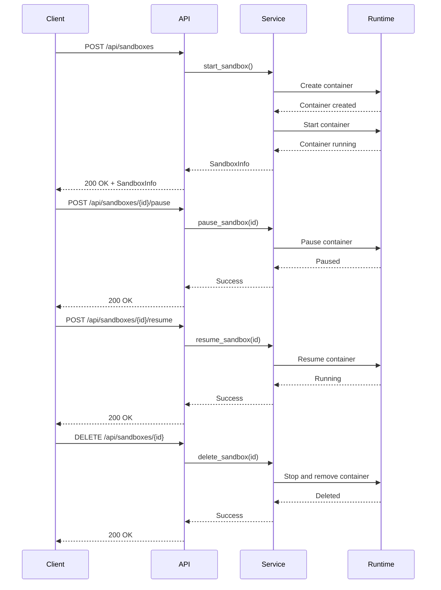
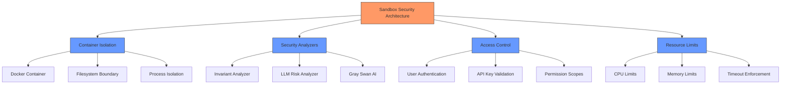
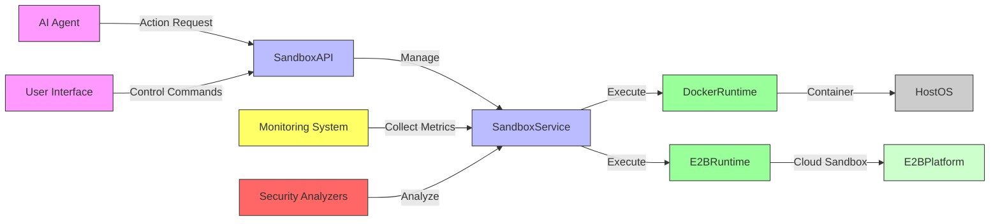

# Sandbox Architecture

<cite>
**Referenced Files in This Document**   
- [sandbox_router.py](file://openhands/app_server/sandbox/sandbox_router.py)
- [sandbox_service.py](file://openhands/app_server/sandbox/sandbox_service.py)
- [sandbox_models.py](file://openhands/app_server/sandbox/sandbox_models.py)
- [docker_sandbox_spec_service.py](file://openhands/app_server/sandbox/docker_sandbox_spec_service.py)
- [sandbox_config.py](file://openhands/core/config/sandbox_config.py)
- [e2b/sandbox.py](file://third_party/runtime/impl/e2b/sandbox.py)
- [e2b-sandbox/Dockerfile](file://third_party/containers/e2b-sandbox/Dockerfile)
- [e2b-sandbox/e2b.toml](file://third_party/containers/e2b-sandbox/e2b.toml)
- [containers.py](file://openhands/runtime/impl/docker/containers.py)
- [security/README.md](file://openhands/security/README.md)
</cite>

## Table of Contents
1. [Introduction](#introduction)
2. [Architecture Overview](#architecture-overview)
3. [Core Components](#core-components)
4. [Sandbox Lifecycle Management](#sandbox-lifecycle-management)
5. [Security and Isolation](#security-and-isolation)
6. [Configuration and Initialization](#configuration-and-initialization)
7. [Technology Stack](#technology-stack)
8. [System Context](#system-context)
9. [Cross-Cutting Concerns](#cross-cutting-concerns)

## Introduction
The Sandbox Architecture component provides secure, isolated execution environments for agent actions within the OpenHands platform. This architecture enables safe code execution by leveraging containerization technologies to create isolated environments where agents can perform tasks without compromising system security. The sandbox system supports multiple backend implementations including Docker, remote execution, and local execution, providing flexibility for different deployment scenarios. The architecture is designed to ensure resource isolation, security boundaries, and controlled access to system resources while maintaining high performance and reliability.

## Architecture Overview
The sandbox architecture follows a modular design with clear separation of concerns between the sandbox controller, execution runtime, and management interfaces. The system provides a REST API for managing sandbox lifecycle operations while abstracting the underlying containerization technology.

**Diagram sources**
- [sandbox_router.py](file://openhands/app_server/sandbox/sandbox_router.py)
- [sandbox_service.py](file://openhands/app_server/sandbox/sandbox_service.py)
- [e2b/sandbox.py](file://third_party/runtime/impl/e2b/sandbox.py)

**Section sources**
- [sandbox_router.py](file://openhands/app_server/sandbox/sandbox_router.py)
- [sandbox_service.py](file://openhands/app_server/sandbox/sandbox_service.py)

## Core Components
The sandbox architecture consists of several core components that work together to provide isolated execution environments. The Sandbox Service acts as the central controller, managing the lifecycle of sandboxes and coordinating between different runtime implementations. The Sandbox Specification Service handles the configuration and provisioning of sandbox environments, including pulling container images and managing specifications. The runtime implementations provide the actual execution environment through various technologies including Docker containers and cloud-based sandboxes.

The architecture supports multiple runtime backends, allowing for flexible deployment options. The Docker runtime provides local containerized execution, while the E2B integration enables cloud-based sandboxing through the E2B platform. Each runtime implements a common interface, ensuring consistent behavior across different execution environments. The system also includes a local runtime option for direct execution without containerization, primarily used for development and testing purposes.

**Section sources**
- [sandbox_service.py](file://openhands/app_server/sandbox/sandbox_service.py)
- [docker_sandbox_spec_service.py](file://openhands/app_server/sandbox/docker_sandbox_spec_service.py)
- [e2b/sandbox.py](file://third_party/runtime/impl/e2b/sandbox.py)

## Sandbox Lifecycle Management
The sandbox lifecycle management system provides comprehensive control over sandbox instances through a well-defined API. The lifecycle includes creation, starting, pausing, resuming, and deletion of sandbox environments. The system uses asynchronous operations to handle potentially long-running tasks such as container image pulling and sandbox initialization.

**Diagram sources**
- [sandbox_router.py](file://openhands/app_server/sandbox/sandbox_router.py)
- [sandbox_service.py](file://openhands/app_server/sandbox/sandbox_service.py)

**Section sources**
- [sandbox_router.py](file://openhands/app_server/sandbox/sandbox_router.py#L52-L91)
- [sandbox_service.py](file://openhands/app_server/sandbox/sandbox_service.py#L34-L61)

## Security and Isolation
The sandbox architecture implements multiple layers of security and isolation to protect the host system and ensure safe execution of agent actions. Containerization provides process and filesystem isolation, preventing sandboxed code from accessing unauthorized resources. The system enforces strict access controls and implements security analyzers to monitor and validate agent actions before execution.

The architecture includes several security mechanisms:
- Filesystem isolation through container boundaries
- Network isolation with restricted connectivity
- Resource limits to prevent denial-of-service attacks
- Security analyzers that evaluate action risk levels
- Environment variable filtering to prevent secret leakage

The Invariant and Gray Swan security analyzers provide advanced protection by analyzing code and commands for potential security issues. These analyzers can detect malicious patterns, prevent secret leaks, and block dangerous operations. The system also supports confirmation mode, requiring user approval for high-risk actions.

**Diagram sources**
- [security/README.md](file://openhands/security/README.md)
- [sandbox_service.py](file://openhands/app_server/sandbox/sandbox_service.py)

**Section sources**
- [security/README.md](file://openhands/security/README.md)
- [sandbox_config.py](file://openhands/core/config/sandbox_config.py)

## Configuration and Initialization
The sandbox system provides flexible configuration options for initialization, environment variables, and mounted volumes. Configuration is managed through the SandboxConfig class, which defines parameters for runtime behavior, resource allocation, and security settings. The system supports both default configurations and custom specifications for specialized use cases.

Key configuration options include:
- Container image selection and base images
- Environment variables for runtime configuration
- Volume mounts for persistent storage
- Resource limits and timeouts
- Network configuration and proxy settings
- Security analyzer selection and policies

The initialization process involves several steps:
1. Configuration validation and default value assignment
2. Container image verification and pulling if necessary
3. Runtime environment setup with specified configurations
4. Volume mounting and filesystem preparation
5. Service exposure and port mapping
6. Health checks and readiness verification

Configuration can be provided through environment variables, configuration files, or API parameters, allowing for flexible deployment in different environments.

**Section sources**
- [sandbox_config.py](file://openhands/core/config/sandbox_config.py)
- [docker_sandbox_spec_service.py](file://openhands/app_server/sandbox/docker_sandbox_spec_service.py)

## Technology Stack
The sandbox architecture leverages a modern technology stack centered around containerization and cloud-native technologies. The primary execution environment is based on Docker containers, providing portable and isolated execution environments. For cloud-based deployments, the system integrates with the E2B platform, offering scalable sandboxing capabilities.

Key technologies in the stack:
- **Docker**: Containerization for local and remote execution environments
- **E2B Platform**: Cloud-based sandboxing with enhanced security features
- **FastAPI**: REST API framework for sandbox management
- **Pydantic**: Data validation and settings management
- **AsyncIO**: Asynchronous operations for efficient resource utilization

The runtime implementations support multiple container backends:
- Docker runtime for local container execution
- E2B cloud runtime for managed sandbox environments
- Remote runtime for distributed execution
- Local runtime for direct process execution

The system also integrates with security tools like Invariant and Gray Swan AI for advanced threat detection and prevention.

**Section sources**
- [e2b/sandbox.py](file://third_party/runtime/impl/e2b/sandbox.py)
- [containers.py](file://openhands/runtime/impl/docker/containers.py)
- [sandbox_config.py](file://openhands/core/config/sandbox_config.py)

## System Context
The sandbox system integrates with the broader OpenHands platform to provide secure execution capabilities for agent actions. It serves as the execution environment for code generated by AI agents, enabling safe interaction with the filesystem, network, and external services.

**Diagram sources**
- [sandbox_router.py](file://openhands/app_server/sandbox/sandbox_router.py)
- [e2b/sandbox.py](file://third_party/runtime/impl/e2b/sandbox.py)

**Section sources**
- [sandbox_router.py](file://openhands/app_server/sandbox/sandbox_router.py)
- [e2b/sandbox.py](file://third_party/runtime/impl/e2b/sandbox.py)

## Cross-Cutting Concerns
The sandbox architecture addresses several cross-cutting concerns to ensure robust and secure operation. Security isolation is implemented through container boundaries, network policies, and security analyzers that monitor agent actions. Resource limits prevent individual sandboxes from consuming excessive system resources, ensuring fair usage and preventing denial-of-service scenarios.

Network access restrictions are enforced through container networking configurations, limiting outbound connections and preventing unauthorized access to internal services. The system implements comprehensive logging and monitoring to track sandbox activities and detect potential security issues. Error handling and recovery mechanisms ensure graceful degradation in case of failures.

The architecture also addresses usability concerns by providing clear APIs, comprehensive documentation, and flexible configuration options. Performance optimization techniques include container image caching, connection pooling, and efficient resource management to minimize startup times and maximize throughput.

**Section sources**
- [sandbox_config.py](file://openhands/core/config/sandbox_config.py)
- [security/README.md](file://openhands/security/README.md)
- [e2b/sandbox.py](file://third_party/runtime/impl/e2b/sandbox.py)