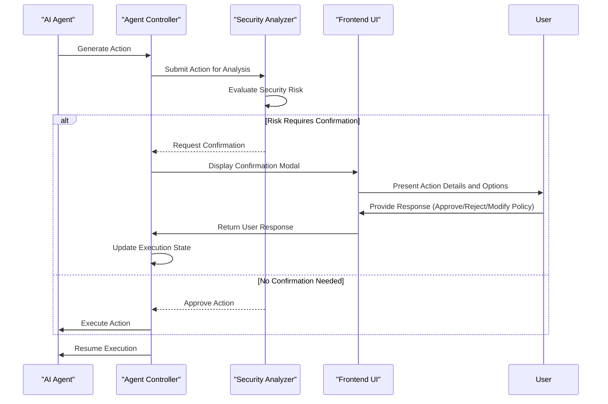
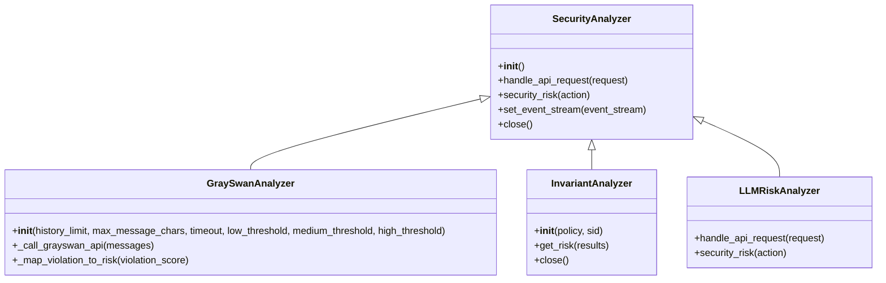
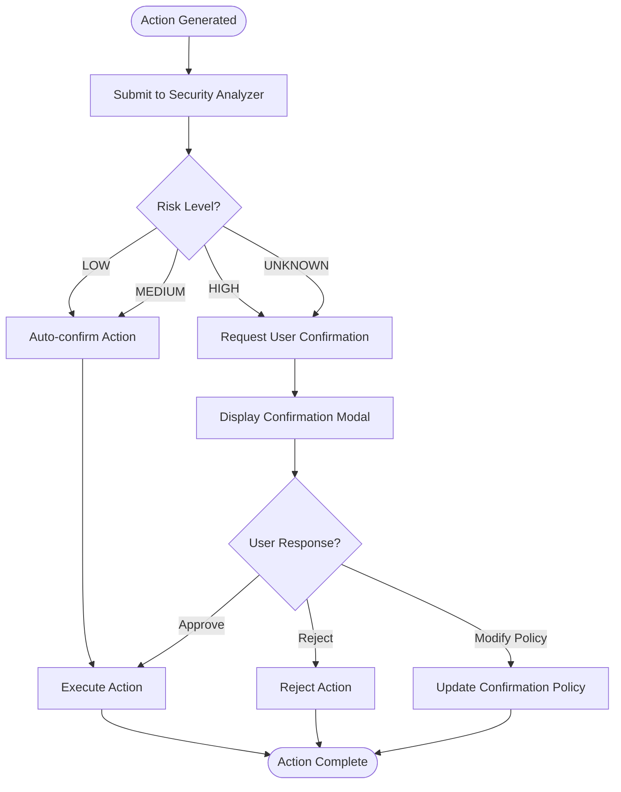
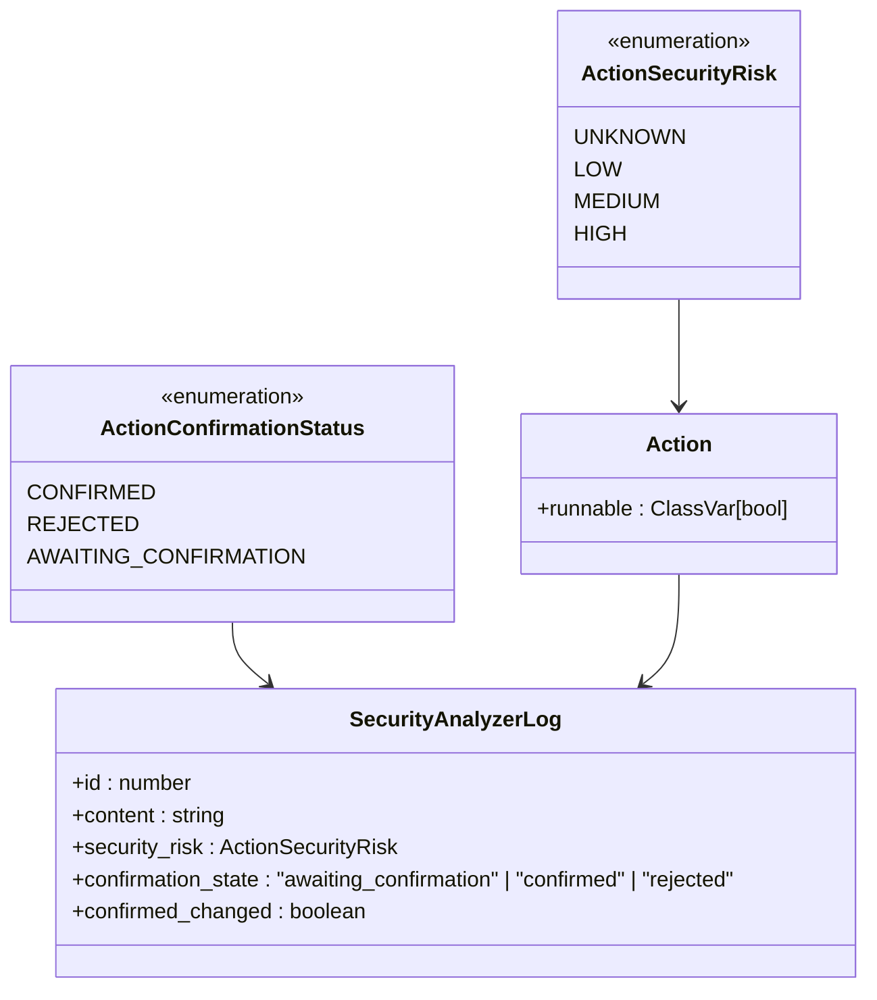
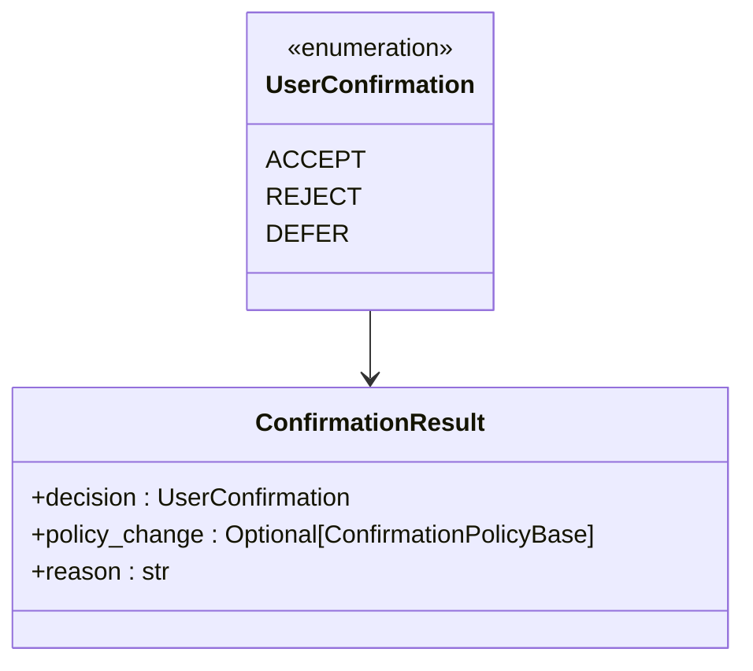
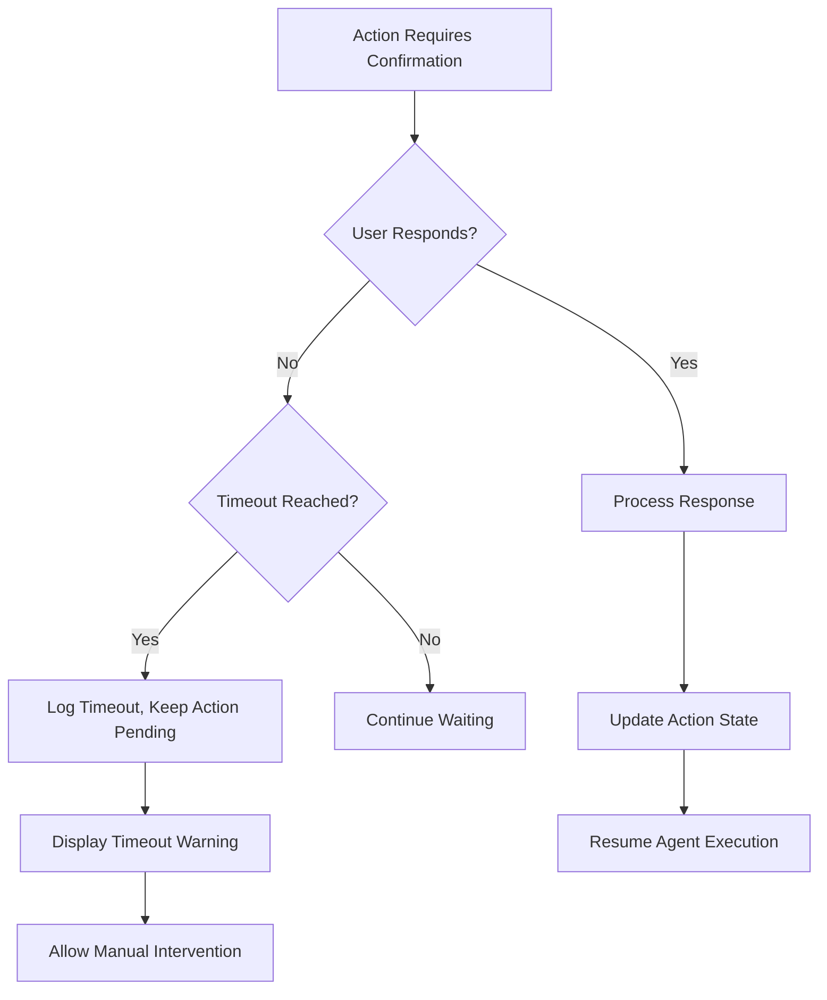

# Confirmation Mode

<cite>
**Referenced Files in This Document**   
- [analyzer.py](file://openhands/security/analyzer.py)
- [options.py](file://openhands/security/options.py)
- [grayswan/analyzer.py](file://openhands/security/grayswan/analyzer.py)
- [invariant/analyzer.py](file://openhands/security/invariant/analyzer.py)
- [llm/analyzer.py](file://openhands/security/llm/analyzer.py)
- [action.py](file://openhands/events/action/action.py)
- [agent_action.py](file://openhands-cli/openhands_cli/user_actions/agent_action.py)
- [runner.py](file://openhands-cli/openhands_cli/runner.py)
- [types.py](file://openhands-cli/openhands_cli/user_actions/types.py)
- [security-analyzer-store.ts](file://frontend/src/stores/security-analyzer-store.ts)
- [confirmation-buttons.tsx](file://frontend/src/components/shared/buttons/confirmation-buttons.tsx)
- [confirmation-modal.tsx](file://frontend/src/components/shared/modals/confirmation-modal.tsx)
- [config.sh](file://containers/app/config.sh)
</cite>

## Table of Contents
1. [Introduction](#introduction)
2. [Core Components](#core-components)
3. [Architecture Overview](#architecture-overview)
4. [Detailed Component Analysis](#detailed-component-analysis)
5. [Domain Model of Confirmation Requests](#domain-model-of-confirmation-requests)
6. [Configuration Options](#configuration-options)
7. [Error Handling and Edge Cases](#error-handling-and-edge-cases)
8. [Conclusion](#conclusion)

## Introduction

The Confirmation Mode feature in OpenHands provides a security mechanism that intercepts potentially risky actions performed by AI agents and presents them to users for approval before execution. This feature acts as a safety layer that prevents unintended or potentially harmful operations while maintaining the agent's ability to perform routine tasks autonomously.

The system is designed with a modular architecture that allows different security analyzers to evaluate actions based on various criteria, from simple rule-based checks to sophisticated AI-powered risk assessment. When a potentially risky action is detected, the system pauses execution and presents a confirmation modal to the user, who can then choose to approve, reject, or modify the confirmation policy for future actions.

This documentation provides a comprehensive overview of the Confirmation Mode implementation, detailing the interaction between the security analyzer, agent controller, and frontend UI, as well as the domain model of confirmation requests and configuration options available to users.

**Section sources**
- [analyzer.py](file://openhands/security/analyzer.py)
- [README.md](file://openhands/security/README.md)

## Core Components

The Confirmation Mode feature consists of several core components that work together to intercept, analyze, and manage potentially risky actions:

1. **Security Analyzer**: The central component that evaluates actions for security risks and determines whether confirmation is required
2. **Agent Controller**: Manages the agent's execution state and handles confirmation requests
3. **Frontend UI**: Presents confirmation modals to users and captures their responses
4. **Event System**: Facilitates communication between components through a stream of events

The security analyzer is implemented as an abstract base class that can be extended to create specific analyzers with different risk assessment strategies. The system supports multiple analyzer types, including GraySwan, Invariant, and LLM-based analyzers, each with its own approach to risk assessment.

The agent controller monitors the agent's state and pauses execution when a confirmation is required. It then delegates to the appropriate user interface component to obtain user input before proceeding.

**Section sources**
- [analyzer.py](file://openhands/security/analyzer.py)
- [runner.py](file://openhands-cli/openhands_cli/runner.py)
- [agent_action.py](file://openhands-cli/openhands_cli/user_actions/agent_action.py)

## Architecture Overview

The Confirmation Mode follows a reactive architecture where actions are intercepted and analyzed before execution. The flow begins when an agent generates an action that requires execution. This action is passed through the security analyzer, which evaluates its risk level and determines whether user confirmation is needed.



**Diagram sources **
- [analyzer.py](file://openhands/security/analyzer.py)
- [runner.py](file://openhands-cli/openhands_cli/runner.py)
- [agent_action.py](file://openhands-cli/openhands_cli/user_actions/agent_action.py)

## Detailed Component Analysis

### Security Analyzer Implementation

The Security Analyzer is implemented as an abstract base class that defines the interface for all security analyzers. Concrete implementations extend this base class to provide specific risk assessment capabilities.



**Diagram sources **
- [analyzer.py](file://openhands/security/analyzer.py)
- [grayswan/analyzer.py](file://openhands/security/grayswan/analyzer.py)
- [invariant/analyzer.py](file://openhands/security/invariant/analyzer.py)
- [llm/analyzer.py](file://openhands/security/llm/analyzer.py)

#### GraySwan Analyzer

The GraySwan analyzer uses external AI safety monitoring to assess risk levels. It sends action details to the GraySwan Cygnal API along with recent conversation history to obtain a violation score, which is then mapped to a risk level (LOW, MEDIUM, HIGH). The analyzer can be configured with custom thresholds for each risk level and supports environment variables for API key and policy ID configuration.

#### Invariant Analyzer

The Invariant analyzer performs purely analytical security checks using a local Docker container running the Invariant server. It parses actions into trace elements and checks them against a security policy. The analyzer maintains a running trace of actions and uses this context to evaluate new actions. It requires Docker to be running on the host system and automatically manages the lifecycle of the Invariant server container.

#### LLM Risk Analyzer

The LLM Risk analyzer respects risk assessments provided by the language model itself. It checks if an action has a security_risk attribute set by the LLM and uses that value if present. This allows the LLM to self-assess the risk level of its proposed actions, providing a lightweight confirmation mechanism that doesn't require external services.

### Agent Controller and Confirmation Flow

The agent controller manages the confirmation workflow by monitoring the agent's state and handling confirmation requests. When a security analyzer determines that confirmation is needed, the controller pauses execution and initiates the user confirmation process.



**Diagram sources **
- [runner.py](file://openhands-cli/openhands_cli/runner.py)
- [agent_action.py](file://openhands-cli/openhands_cli/user_actions/agent_action.py)

**Section sources**
- [runner.py](file://openhands-cli/openhands_cli/runner.py)
- [agent_action.py](file://openhands-cli/openhands_cli/user_actions/agent_action.py)

## Domain Model of Confirmation Requests

The domain model for confirmation requests is built around several key entities that represent actions, security risks, and user responses.

### Action and Security Risk Model



**Diagram sources **
- [action.py](file://openhands/events/action/action.py)
- [security-analyzer-store.ts](file://frontend/src/stores/security-analyzer-store.ts)

The `ActionSecurityRisk` enumeration defines four risk levels: UNKNOWN, LOW, MEDIUM, and HIGH. These levels are used by security analyzers to classify actions based on their potential impact. The `ActionConfirmationStatus` enumeration tracks the state of confirmation requests, allowing the system to manage pending, confirmed, and rejected actions.

The `SecurityAnalyzerLog` interface in the frontend stores information about analyzed actions, including their content, risk level, and confirmation state. Each log entry has a unique ID that allows it to be tracked across the system.

### User Confirmation Model

The user confirmation process is modeled using the `UserConfirmation` enumeration and `ConfirmationResult` class, which capture the user's decision and any associated policy changes.



**Diagram sources **
- [types.py](file://openhands-cli/openhands_cli/user_actions/types.py)

When a user responds to a confirmation request, they can choose to accept the action, reject it (with or without a reason), or defer the decision (which pauses the agent). They can also modify the confirmation policy, either disabling confirmation mode entirely or switching to a risk-based policy that automatically confirms low and medium risk actions while requiring confirmation for high-risk actions.

## Configuration Options

The Confirmation Mode feature provides several configuration options that allow users to customize its behavior according to their security requirements and workflow preferences.

### Enabling and Disabling Confirmation Mode

Confirmation Mode can be enabled or disabled through multiple methods:

1. **Web Interface**: Users can access the Configuration panel (gear icon) and select or deselect a Security Analyzer from the dropdown menu.
2. **Configuration File**: Users can modify the `config.toml` file to enable or disable confirmation mode:

```toml
[security]
# Enable confirmation mode
confirmation_mode = true
# The security analyzer to use
security_analyzer = "your-security-analyzer"
```

To disable confirmation mode, users can remove these lines from the configuration file.

**Section sources**
- [config.sh](file://containers/app/config.sh)
- [README.md](file://openhands/security/README.md)

### Risk Threshold Configuration

Different security analyzers support various configuration options for customizing risk assessment:

- **GraySwan Analyzer**: Can be configured with custom thresholds for low, medium, and high risk levels through constructor parameters or environment variables.
- **Invariant Analyzer**: Supports custom security policies that can be specified when initializing the analyzer.
- **LLM Risk Analyzer**: Relies on the LLM's self-assessment of risk, which can be influenced by the prompt and model configuration.

These configuration options allow users to fine-tune the sensitivity of the security analysis to match their specific use cases and risk tolerance.

## Error Handling and Edge Cases

The Confirmation Mode implementation includes robust error handling for various edge cases and failure scenarios.

### Handling Timed-Out Confirmations

When a security analyzer fails to respond within the configured timeout period, it returns an UNKNOWN risk level, which triggers a confirmation request. This ensures that actions are not executed without proper review when the analyzer is unavailable. The GraySwan analyzer, for example, has a configurable timeout parameter that defaults to 30 seconds.

### Managing Multiple Pending Confirmations

The system handles multiple pending confirmations by batching them together in a single confirmation request. When the agent generates multiple actions that require confirmation, they are presented to the user as a group, allowing for efficient review and approval. The frontend UI displays a log of all pending actions, showing their content, risk level, and confirmation status.

### Secure Communication of Sensitive Action Details

Sensitive action details are communicated securely between components using encrypted channels. The frontend UI only displays action details to authenticated users, and all communication with the security analyzer occurs over HTTPS. For external analyzers like GraySwan, API keys are stored as environment variables and never exposed to the frontend.

### State Management and Recovery

The system maintains the state of confirmation requests even if the agent is paused or restarted. The security analyzer logs are persisted in the frontend store, allowing users to review past confirmation requests and their outcomes. If a confirmation request times out or fails, the system defaults to requiring user confirmation, erring on the side of caution.



**Diagram sources **
- [runner.py](file://openhands-cli/openhands_cli/runner.py)
- [security-analyzer-store.ts](file://frontend/src/stores/security-analyzer-store.ts)

**Section sources**
- [runner.py](file://openhands-cli/openhands_cli/runner.py)
- [security-analyzer-store.ts](file://frontend/src/stores/security-analyzer-store.ts)

## Conclusion

The Confirmation Mode feature in OpenHands provides a comprehensive security framework that balances automation with human oversight. By intercepting potentially risky actions and presenting them for user approval, the system prevents unintended consequences while maintaining the agent's ability to perform routine tasks autonomously.

The modular architecture supports multiple security analyzers with different risk assessment strategies, allowing users to choose the approach that best fits their needs. The integration between the security analyzer, agent controller, and frontend UI is seamless, providing a smooth user experience for reviewing and approving actions.

Key strengths of the implementation include:
- Flexible configuration options for enabling/disabling confirmation mode and setting risk thresholds
- Support for multiple security analyzer types with different capabilities
- Robust error handling for edge cases like timeouts and connection failures
- Secure communication of sensitive action details
- Persistent state management that survives agent restarts

The domain model of confirmation requests is well-designed, with clear separation between action metadata, risk assessment scores, and user response handling. This makes it easy to extend the system with new analyzer types or modify the confirmation workflow.

Overall, the Confirmation Mode feature demonstrates a thoughtful approach to AI safety that empowers users to maintain control over their agents while benefiting from automation.