# Security & Risk Management

<cite>
**Referenced Files in This Document**   
- [analyzer.py](file://openhands/security/analyzer.py)
- [options.py](file://openhands/security/options.py)
- [llm/analyzer.py](file://openhands/security/llm/analyzer.py)
- [invariant/analyzer.py](file://openhands/security/invariant/analyzer.py)
- [grayswan/analyzer.py](file://openhands/security/grayswan/analyzer.py)
- [grayswan/utils.py](file://openhands/security/grayswan/utils.py)
- [invariant/client.py](file://openhands/security/invariant/client.py)
- [invariant/policies.py](file://openhands/security/invariant/policies.py)
- [invariant/parser.py](file://openhands/security/invariant/parser.py)
- [security_config.py](file://openhands/core/config/security_config.py)
- [agent_controller.py](file://openhands/controller/agent_controller.py)
- [agent_action.py](file://openhands_cli/user_actions/agent_action.py)
- [runner.py](file://openhands_cli/runner.py)
- [invariant-service.ts](file://frontend/src/api/invariant-service.ts)
- [confirmation-modal.tsx](file://frontend/src/components/shared/modals/confirmation-modal.tsx)
- [security-lock.tsx](file://frontend/src/components/features/controls/security-lock.tsx)
</cite>

## Table of Contents
1. [Introduction](#introduction)
2. [Architecture Overview](#architecture-overview)
3. [Security Analyzers](#security-analyzers)
4. [Real-time Risk Assessment](#real-time-risk-assessment)
5. [Confirmation Mode](#confirmation-mode)
6. [Component Interactions](#component-interactions)
7. [Infrastructure Requirements](#infrastructure-requirements)
8. [Scalability Considerations](#scalability-considerations)
9. [Deployment Topology](#deployment-topology)
10. [Cross-cutting Concerns](#cross-cutting-concerns)
11. [Technology Stack](#technology-stack)
12. [System Context Diagrams](#system-context-diagrams)

## Introduction

The Security & Risk Management component in OpenHands provides a comprehensive multi-layered security framework designed to ensure safe and reliable operation of AI agents. This system implements a sophisticated approach to risk assessment and mitigation through multiple security analyzers that work in concert to identify and prevent potentially harmful actions.

The architecture is built around a pluggable security analyzer framework that allows for different risk assessment strategies while maintaining a consistent interface. The system supports three primary security analyzers: LLM Risk Analyzer, Invariant, and GraySwan, each providing different approaches to risk detection and mitigation.

Key architectural principles include:
- **Modularity**: Security analyzers are implemented as pluggable components
- **Real-time assessment**: Risk evaluation occurs before action execution
- **User control**: Confirmation mode allows users to approve or reject actions
- **Extensibility**: The framework supports custom security analyzers

The security system is designed to balance safety with usability, providing robust protection against unintended actions while minimizing disruption to legitimate workflows.

## Architecture Overview

The Security & Risk Management architecture follows a layered approach with multiple security analyzers that can be selected based on the specific requirements of the deployment. The system is built around the SecurityAnalyzer base class, which defines a consistent interface for all security implementations.

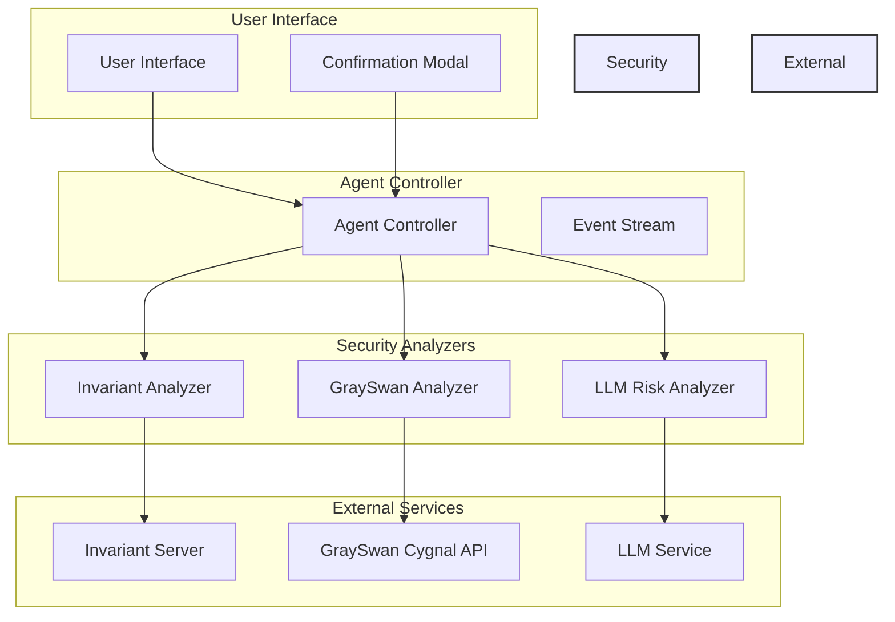

**Diagram sources**
- [analyzer.py](file://openhands/security/analyzer.py)
- [agent_controller.py](file://openhands/controller/agent_controller.py)
- [options.py](file://openhands/security/options.py)

**Section sources**
- [analyzer.py](file://openhands/security/analyzer.py)
- [options.py](file://openhands/security/options.py)

## Security Analyzers

The OpenHands security framework supports multiple security analyzers that can be configured based on the specific requirements of the deployment. Each analyzer implements a different approach to risk assessment while adhering to the common SecurityAnalyzer interface.

### LLM Risk Analyzer

The LLM Risk Analyzer is the default security analyzer that leverages risk assessments provided by the LLM itself. This analyzer checks for a `security_risk` attribute on actions generated by the LLM and uses this information to determine the appropriate risk level.

Key features:
- Uses LLM-provided risk assessments (LOW, MEDIUM, HIGH)
- Automatically requires confirmation for HIGH-risk actions
- Lightweight and efficient with no external dependencies
- Integrates seamlessly with the agent's decision-making process

The analyzer maps LLM-provided risk assessments to the appropriate ActionSecurityRisk level and defaults to UNKNOWN if no risk assessment is provided.

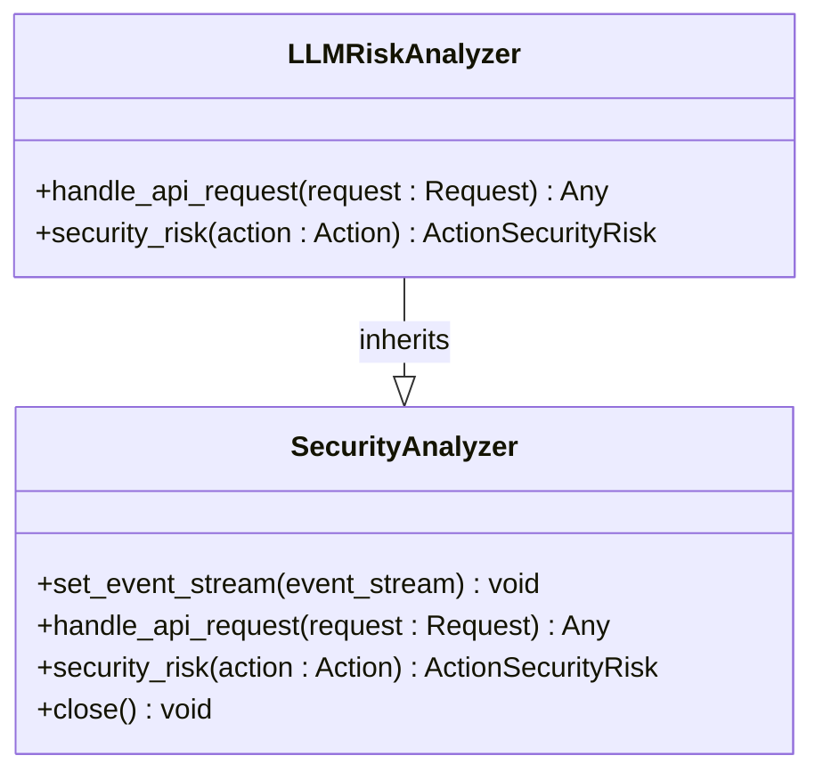

**Diagram sources**
- [llm/analyzer.py](file://openhands/security/llm/analyzer.py)
- [analyzer.py](file://openhands/security/analyzer.py)

**Section sources**
- [llm/analyzer.py](file://openhands/security/llm/analyzer.py)

### Invariant Analyzer

The Invariant Analyzer uses the Invariant platform to analyze traces and detect potential issues with OpenHands workflows. It provides comprehensive protection against various security threats and can be configured with custom policies.

Key detection capabilities:
- Potential secret leaks by the agent
- Security issues in Python code
- Malicious bash commands
- Dangerous user tasks (browsing agent setting)
- Harmful content generation (browsing agent setting)

The analyzer runs as a Docker container and communicates with the Invariant server to perform real-time analysis of agent actions.

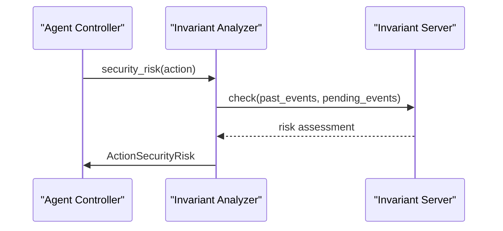

**Diagram sources**
- [invariant/analyzer.py](file://openhands/security/invariant/analyzer.py)
- [invariant/client.py](file://openhands/security/invariant/client.py)

**Section sources**
- [invariant/analyzer.py](file://openhands/security/invariant/analyzer.py)
- [invariant/client.py](file://openhands/security/invariant/client.py)

### GraySwan Analyzer

The GraySwan Analyzer integrates with Gray Swan AI's Cygnal API to provide advanced AI safety monitoring. This analyzer uses external API calls to assess the risk level of agent actions based on comprehensive safety policies.

Configuration requirements:
- GRAYSWAN_API_KEY: Required API key for authentication
- GRAYSWAN_POLICY_ID: Optional custom policy ID

The analyzer converts OpenHands events to OpenAI message format and sends them to the Cygnal API for risk assessment, receiving a violation score that is mapped to an appropriate risk level.

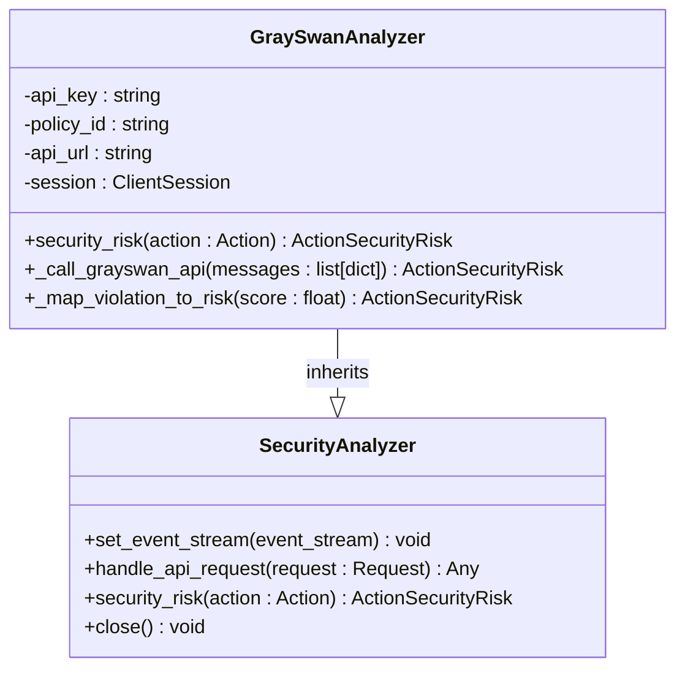

**Diagram sources**
- [grayswan/analyzer.py](file://openhands/security/grayswan/analyzer.py)
- [analyzer.py](file://openhands/security/analyzer.py)

**Section sources**
- [grayswan/analyzer.py](file://openhands/security/grayswan/analyzer.py)

## Real-time Risk Assessment

The real-time risk assessment system in OpenHands evaluates agent actions before execution to prevent potentially harmful operations. This assessment occurs as part of the agent's action processing pipeline and is integrated with the confirmation mode system.

### Risk Assessment Workflow

The risk assessment process follows a consistent pattern across all security analyzers:

1. An action is generated by the agent
2. The security analyzer evaluates the action's risk level
3. The risk level is used to determine whether confirmation is required
4. The action is either executed, confirmed, or rejected based on the risk assessment

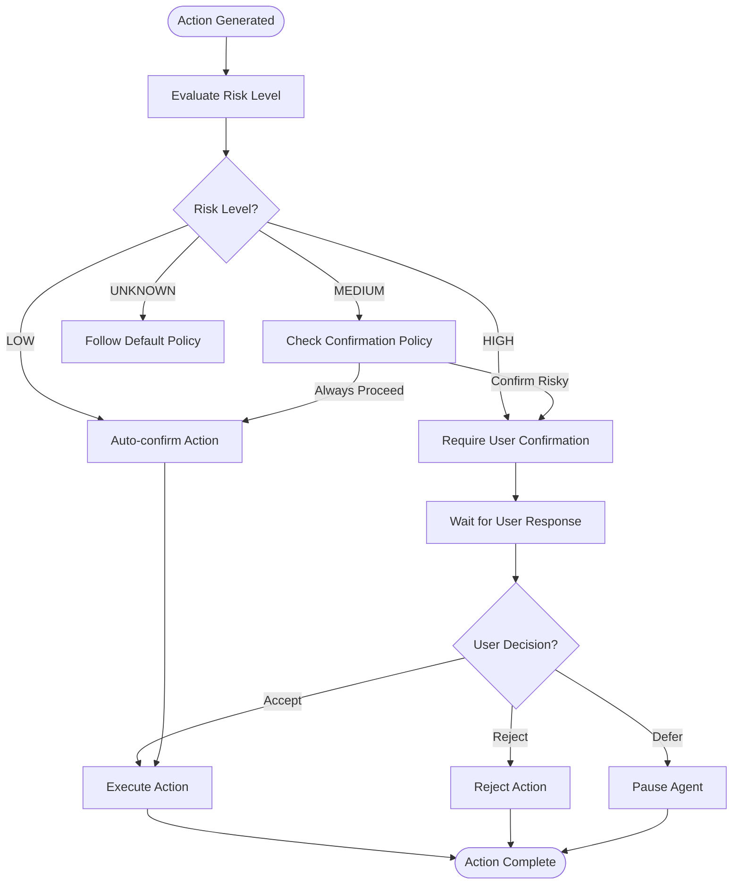

**Diagram sources**
- [agent_controller.py](file://openhands/controller/agent_controller.py)
- [analyzer.py](file://openhands/security/analyzer.py)

**Section sources**
- [agent_controller.py](file://openhands/controller/agent_controller.py)

### Risk Level Classification

The system uses a standardized risk classification system with four levels:

- **LOW**: Minimal risk actions that typically do not require confirmation
- **MEDIUM**: Moderate risk actions that may require confirmation based on policy
- **HIGH**: High risk actions that typically require user confirmation
- **UNKNOWN**: Risk level could not be determined

Each security analyzer maps its internal risk assessment to these standardized levels, ensuring consistent behavior across different analyzer implementations.

## Confirmation Mode

Confirmation mode is a key security feature that allows users to review and approve potentially risky actions before they are executed. This mode provides a balance between security and usability by allowing users to maintain control over agent operations.

### Confirmation Policy Management

The system supports multiple confirmation policies that can be selected by users:

- **Always confirm**: All actions require user confirmation
- **Never confirm**: No actions require confirmation (security analyzer disabled)
- **Confirm risky**: Only HIGH-risk actions require confirmation
- **Auto-confirm LOW/MEDIUM**: Auto-confirm LOW and MEDIUM risk actions, ask for HIGH risk

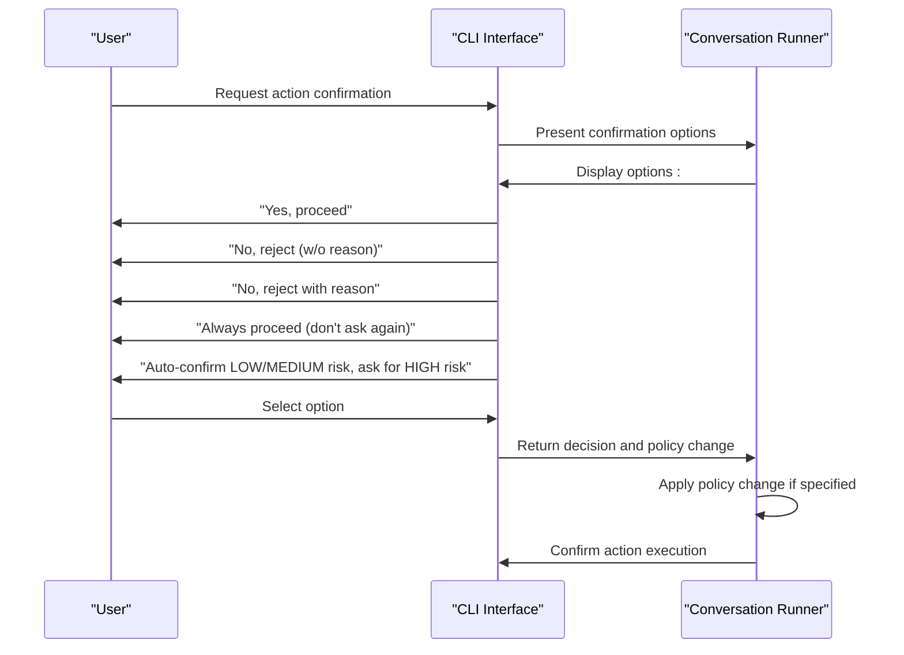

**Diagram sources**
- [agent_action.py](file://openhands_cli/user_actions/agent_action.py)
- [runner.py](file://openhands_cli/runner.py)

**Section sources**
- [agent_action.py](file://openhands_cli/user_actions/agent_action.py)
- [runner.py](file://openhands_cli/runner.py)

### User Interface Components

The frontend provides several components for managing confirmation mode:

- **Security Lock**: Visual indicator in the control panel
- **Confirmation Modal**: Dialog for approving or rejecting actions
- **Settings Integration**: Configuration options in the settings panel

These components work together to provide a seamless user experience for managing security confirmations.

## Component Interactions

The security system involves complex interactions between multiple components, including the agent controller, security analyzers, user interface, and external services.

### Agent Controller Integration

The agent controller is responsible for coordinating security analysis and implementing the results:

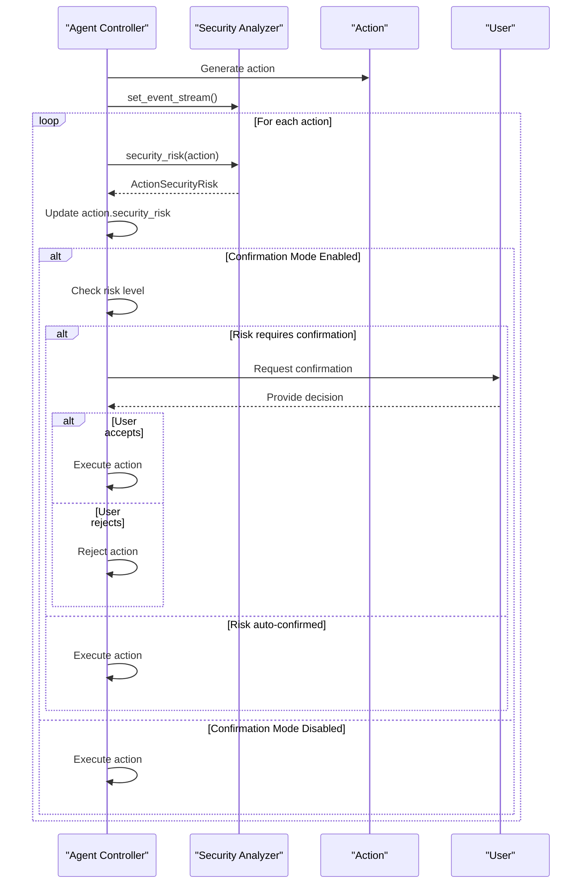

**Diagram sources**
- [agent_controller.py](file://openhands/controller/agent_controller.py)
- [analyzer.py](file://openhands/security/analyzer.py)

**Section sources**
- [agent_controller.py](file://openhands/controller/agent_controller.py)

### Event Stream Processing

The security analyzers process events from the event stream to maintain context for risk assessment:

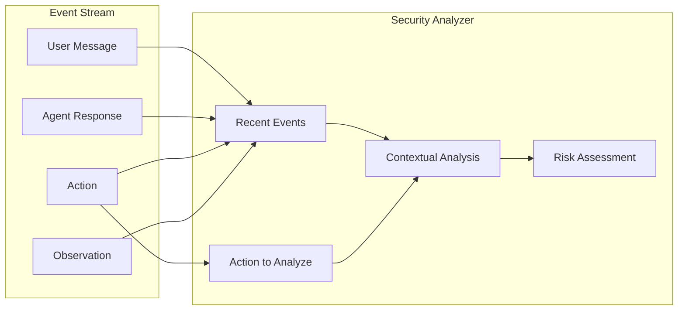

**Diagram sources**
- [analyzer.py](file://openhands/security/analyzer.py)
- [grayswan/analyzer.py](file://openhands/security/grayswan/analyzer.py)

## Infrastructure Requirements

The security system has specific infrastructure requirements that vary depending on the selected security analyzer.

### Invariant Analyzer Requirements

The Invariant Analyzer requires Docker to run the Invariant server container:

- Docker daemon must be running
- Sufficient memory and CPU resources for the container
- Network access to the Invariant server
- Port availability for the API server

The analyzer automatically manages the Invariant server container, starting it if not already running.

### GraySwan Analyzer Requirements

The GraySwan Analyzer has the following requirements:

- Internet connectivity to access the GraySwan API
- Environment variables configured:
  - GRAYSWAN_API_KEY: Required for authentication
  - GRAYSWAN_POLICY_ID: Optional custom policy ID
- Network timeout configuration (default: 30 seconds)
- HTTPS connectivity for secure API calls

### General Requirements

All security analyzers share these common requirements:

- Access to the agent's event stream
- Sufficient memory to maintain event history
- Thread-safe operation for concurrent access
- Error handling for network and service failures
- Logging capabilities for audit and debugging

## Scalability Considerations

The security system is designed with scalability in mind, supporting both single-user and multi-user deployments.

### Performance Impact

Security analysis introduces some performance overhead that varies by analyzer:

- **LLM Risk Analyzer**: Minimal overhead (local attribute check)
- **Invariant Analyzer**: Moderate overhead (local container processing)
- **GraySwan Analyzer**: Higher overhead (external API calls)

The system mitigates performance impact through:

- Caching of recent events
- Asynchronous processing where possible
- Configurable history limits
- Timeout handling for external services

### Resource Management

The system includes several resource management features:

- Configurable event history limits
- Connection pooling for external services
- Graceful degradation when services are unavailable
- Memory-efficient event processing

### Horizontal Scaling

For multi-user deployments, the system supports horizontal scaling through:

- Independent security analyzer instances per user/session
- Shared external services (GraySwan API)
- Containerized components for easy deployment
- Stateless design where possible

## Deployment Topology

The deployment topology for the security system varies based on the selected analyzer and deployment environment.

### Local Deployment

For local deployments, the topology includes:

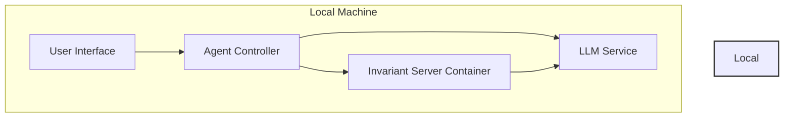

**Diagram sources**
- [invariant/analyzer.py](file://openhands/security/invariant/analyzer.py)

### Cloud Deployment

For cloud deployments with external services:

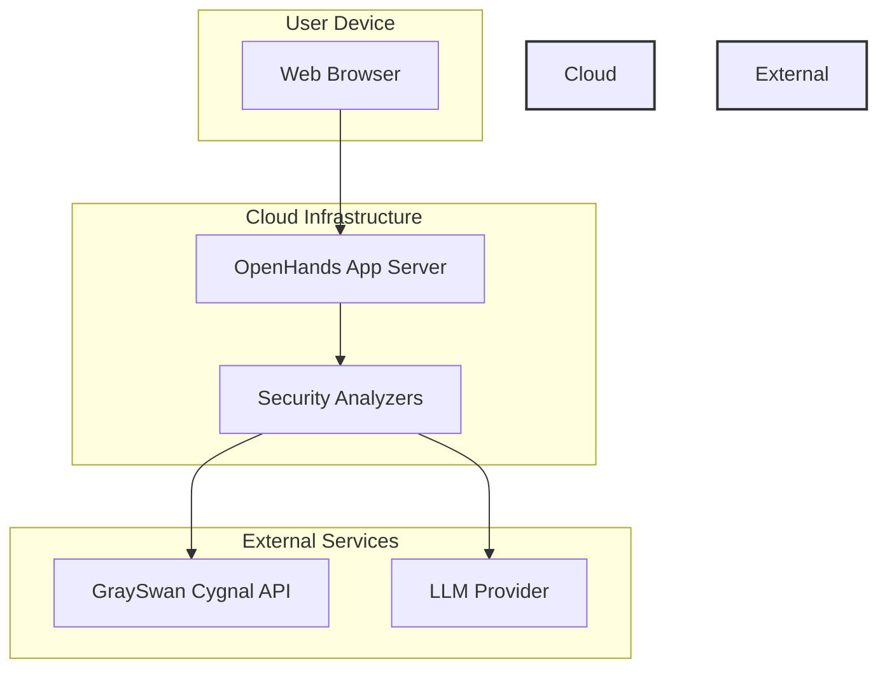

**Diagram sources**
- [grayswan/analyzer.py](file://openhands/security/grayswan/analyzer.py)

## Cross-cutting Concerns

The security system addresses several cross-cutting concerns that affect multiple components.

### False Positive Reduction

The system employs several strategies to minimize false positives:

- **Context-aware analysis**: Using recent events to understand action context
- **Risk threshold tuning**: Configurable thresholds for different risk levels
- **Multiple analyzer options**: Different approaches to risk assessment
- **User feedback loop**: Learning from user confirmation decisions

### Performance Impact

To minimize performance impact:

- **Asynchronous processing**: Non-blocking security analysis
- **Caching**: Storing recent analysis results
- **Configurable limits**: History and message size limits
- **Timeout handling**: Preventing long delays from external services

### User Experience

The system prioritizes user experience through:

- **Clear risk communication**: Informing users of action risks
- **Flexible policies**: Multiple confirmation options
- **Visual indicators**: Security status in the UI
- **Seamless integration**: Minimal disruption to workflow

## Technology Stack

The security system leverages a diverse technology stack to provide comprehensive protection.

### Core Components

- **Python**: Primary implementation language
- **FastAPI**: Web framework for API endpoints
- **Docker**: Containerization for Invariant analyzer
- **Aiohttp**: Async HTTP client for API calls
- **Httpx**: HTTP client for Invariant server

### Security Analyzers

- **LLM Risk Analyzer**: Built-in Python implementation
- **Invariant Analyzer**: Docker container with Invariant server
- **GraySwan Analyzer**: Integration with GraySwan Cygnal API

### Supporting Utilities

- **Event Stream**: Core event processing system
- **View**: Context management for event processing
- **Logging**: Comprehensive logging for audit and debugging
- **Configuration**: TOML-based configuration system

## System Context Diagrams

### Security Workflow

The complete security workflow from action generation to risk assessment and user confirmation:

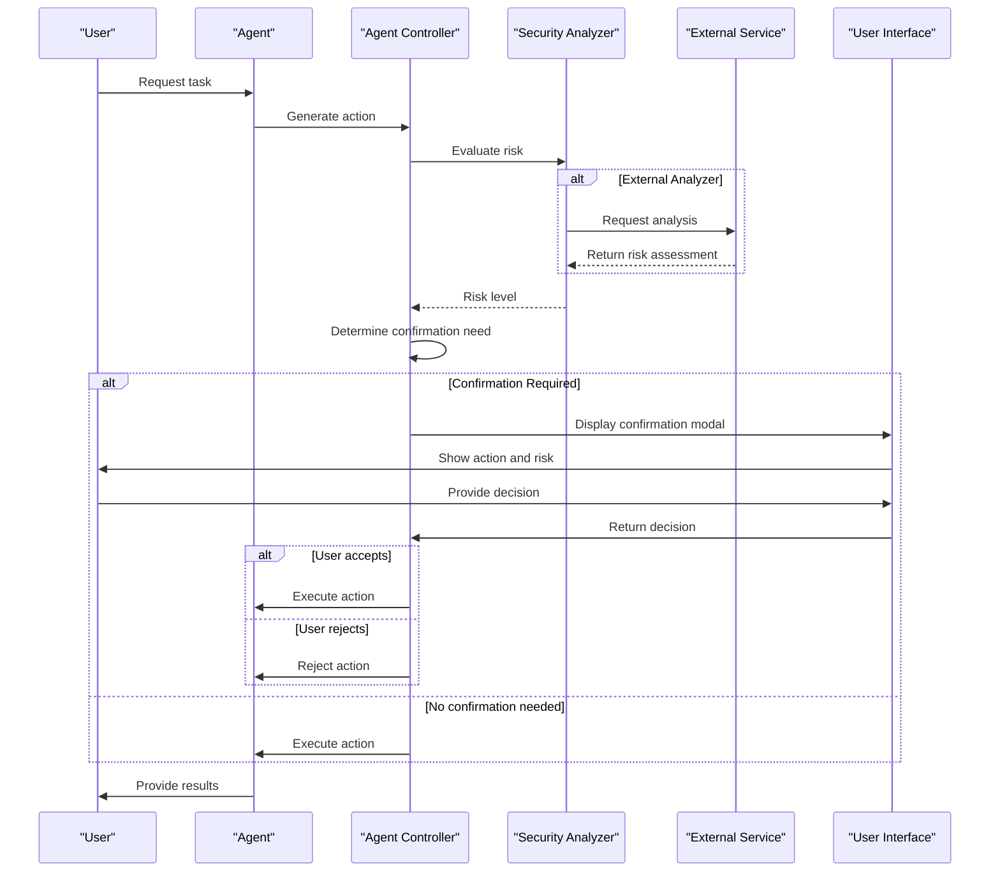

**Diagram sources**
- [agent_controller.py](file://openhands/controller/agent_controller.py)
- [analyzer.py](file://openhands/security/analyzer.py)
- [agent_action.py](file://openhands_cli/user_actions/agent_action.py)

### Data Flow

The data flow for security analysis:

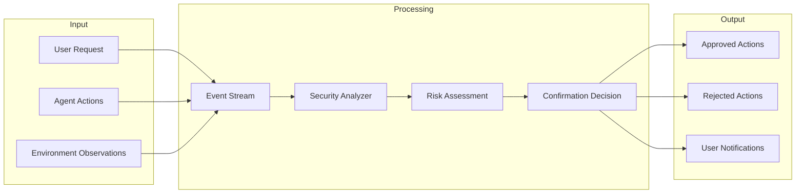

**Diagram sources**
- [analyzer.py](file://openhands/security/analyzer.py)
- [agent_controller.py](file://openhands/controller/agent_controller.py)