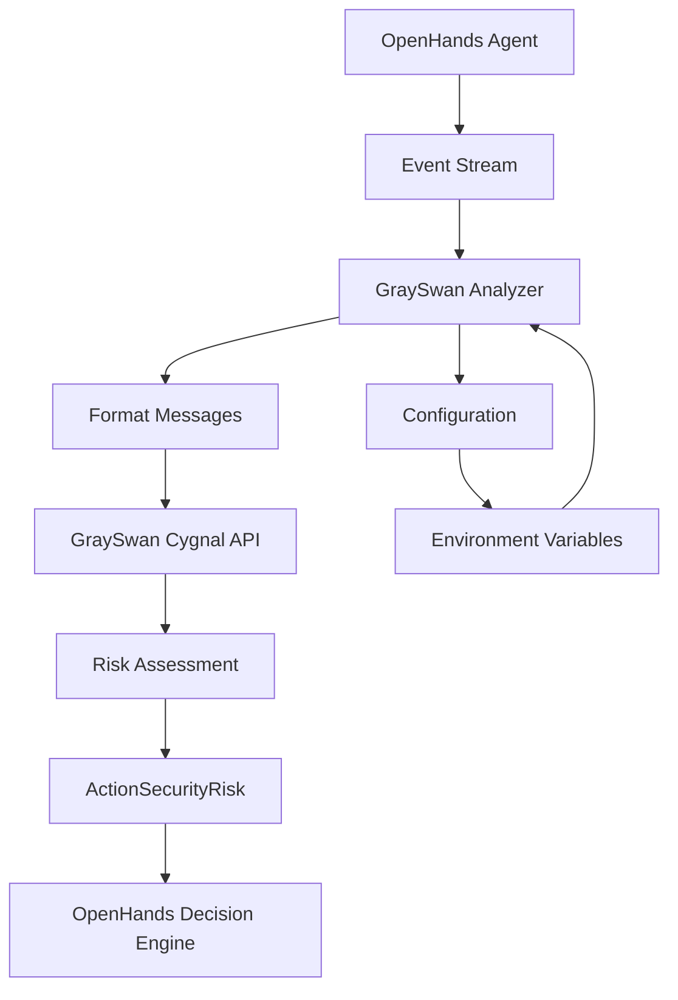
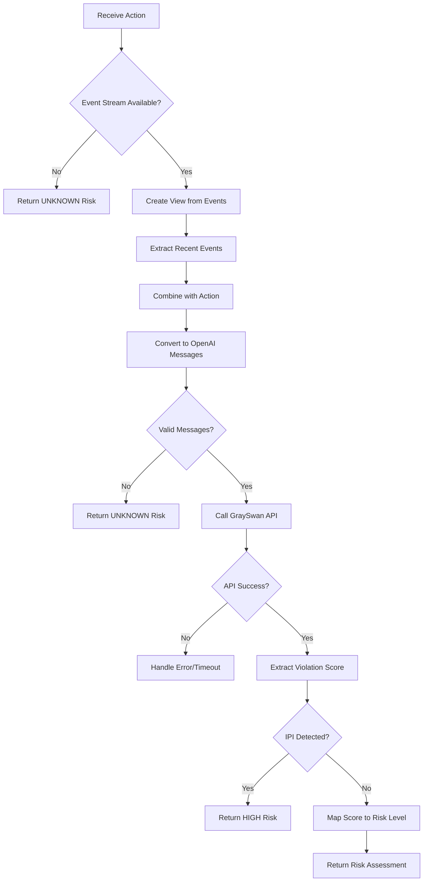
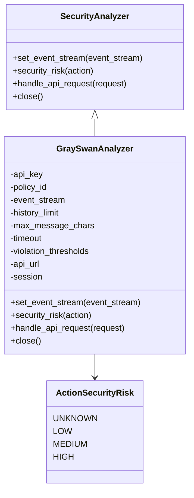

# GraySwan Analyzer

<cite>
**Referenced Files in This Document**   
- [analyzer.py](file://openhands/security/grayswan/analyzer.py)
- [utils.py](file://openhands/security/grayswan/utils.py)
- [analyzer.py](file://openhands/security/analyzer.py)
- [options.py](file://openhands/security/options.py)
- [README.md](file://openhands/security/README.md)
</cite>

## Table of Contents
1. [Introduction](#introduction)
2. [Architecture Overview](#architecture-overview)
3. [Core Components](#core-components)
4. [Analysis Pipeline](#analysis-pipeline)
5. [Configuration Options](#configuration-options)
6. [Integration with Security Framework](#integration-with-security-framework)
7. [Risk Assessment and Thresholds](#risk-assessment-and-thresholds)
8. [Performance and Reliability](#performance-and-reliability)
9. [Extensibility and Customization](#extensibility-and-customization)
10. [Troubleshooting Guide](#troubleshooting-guide)

## Introduction

The GraySwan Analyzer is a security component within the OpenHands framework that performs deep analysis of code changes proposed by agents. It integrates with Gray Swan AI's Cygnal API to provide advanced AI safety monitoring, detecting potential security vulnerabilities, injection attacks, and other malicious patterns in agent actions. The analyzer evaluates proposed modifications by analyzing the conversation context and action content, providing risk assessments that inform the system's decision-making process.

The GraySwan Analyzer operates as part of OpenHands' modular security framework, which allows for different security analysis strategies. It is specifically designed to detect sophisticated threats such as indirect prompt injection (IPI), code injection vulnerabilities, and other security exploits that could compromise system integrity. By leveraging external AI-powered analysis through the Cygnal API, the GraySwan Analyzer provides a robust layer of protection that complements the agent's own decision-making processes.

**Section sources**
- [README.md](file://openhands/security/README.md#L1-L130)

## Architecture Overview

The GraySwan Analyzer follows a client-server architecture pattern where the OpenHands security component acts as a client to the external GraySwan Cygnal API. This design enables sophisticated analysis without requiring extensive computational resources within the OpenHands environment itself. The analyzer processes agent actions and their contextual conversation history, formats this information appropriately, and submits it to the GraySwan API for comprehensive security assessment.

**Diagram sources**
- [analyzer.py](file://openhands/security/grayswan/analyzer.py#L18-L205)
- [utils.py](file://openhands/security/grayswan/utils.py#L1-L146)

## Core Components

The GraySwan Analyzer consists of several key components that work together to provide comprehensive security analysis. The main class, `GraySwanAnalyzer`, inherits from the base `SecurityAnalyzer` class and implements the specific functionality required for GraySwan integration. This class handles the entire analysis workflow, from receiving agent actions to returning risk assessments.

A critical component is the message conversion utility that transforms OpenHands events into the OpenAI message format expected by the GraySwan API. This conversion process carefully handles different event types, including user messages, agent responses, tool calls, and observations, ensuring that the context provided to the analysis API accurately reflects the agent's operational environment. The conversion process also includes safeguards such as removing security risk information from tool call arguments to prevent biasing the analysis.

The analyzer maintains an HTTP session for efficient communication with the GraySwan API, handling authentication via API key and managing request timeouts. It also implements proper resource cleanup through the `close` method, ensuring that HTTP sessions are properly terminated when the analyzer is no longer needed.

**Section sources**
- [analyzer.py](file://openhands/security/grayswan/analyzer.py#L1-L205)
- [utils.py](file://openhands/security/grayswan/utils.py#L1-L146)

## Analysis Pipeline

The GraySwan Analyzer processes agent actions through a well-defined pipeline that ensures comprehensive security assessment. When an action is submitted for analysis, the pipeline begins by retrieving the relevant conversation history from the event stream. The analyzer uses the `View` class to access events, which applies context management such as trimming and summarization to provide a realistic representation of what the agent's LLM can see.

The pipeline then selects a configurable number of recent events (determined by the `history_limit` parameter) to include as context for the analysis. These events are combined with the proposed action and converted into OpenAI message format using the `convert_events_to_openai_messages` utility function. This conversion process handles various event types appropriately, mapping them to the corresponding roles (user, assistant, system, or tool) in the message sequence.

Once the messages are formatted, they are packaged into a payload with the GraySwan policy ID and sent to the Cygnal API endpoint. The analyzer handles the API response, extracting the violation score and mapping it to an appropriate risk level. Special handling is implemented for indirect prompt injection (IPI) detection, which automatically escalates to HIGH risk regardless of the violation score. The pipeline includes comprehensive error handling for network issues, API errors, and timeouts, ensuring robust operation even in adverse conditions.

**Diagram sources**
- [analyzer.py](file://openhands/security/grayswan/analyzer.py#L165-L205)
- [utils.py](file://openhands/security/grayswan/utils.py#L23-L146)

## Configuration Options

The GraySwan Analyzer provides several configuration options that allow users to customize its behavior according to their security requirements and operational constraints. These options can be set through environment variables or programmatically when initializing the analyzer instance.

The primary configuration requirements are the `GRAYSWAN_API_KEY` environment variable, which is mandatory for authentication with the GraySwan API, and the optional `GRAYSWAN_POLICY_ID` which specifies a custom policy for analysis. If no policy ID is provided, the analyzer uses a default policy optimized for coding agent security.

The analyzer also supports several initialization parameters that control its behavior:
- `history_limit`: Determines how many recent events are included as context for analysis (default: 20)
- `max_message_chars`: Sets the maximum number of characters for conversation processing
- `timeout`: Configures the request timeout in seconds (default: 30)
- `low_threshold`, `medium_threshold`, `high_threshold`: Define the violation score thresholds for risk classification

These parameters allow fine-tuning of the analysis process to balance thoroughness with performance considerations. For example, increasing the history limit provides more context but may impact analysis speed, while adjusting the thresholds changes the sensitivity of vulnerability detection.

**Section sources**
- [analyzer.py](file://openhands/security/grayswan/analyzer.py#L21-L80)
- [README.md](file://openhands/security/README.md#L115-L130)

## Integration with Security Framework

The GraySwan Analyzer integrates seamlessly with OpenHands' modular security framework through well-defined interfaces and registration mechanisms. It implements the `SecurityAnalyzer` abstract base class, adhering to the required method signatures and behavior patterns. This design allows the GraySwan Analyzer to be easily substituted with other security analyzers or used alongside them within the same system.

The integration is facilitated through the `SecurityAnalyzers` registry in the `options.py` file, which maps string identifiers to analyzer classes. By including 'grayswan' as a key with the `GraySwanAnalyzer` class as its value, the analyzer becomes available for selection through both the web interface and configuration files. This registration enables users to switch between different security analysis strategies without modifying code.

The analyzer interacts with the core system through the event stream, which provides access to the conversation history and agent actions. It implements the `set_event_stream` method to receive this stream when the security framework initializes the analyzer. The `security_risk` method serves as the primary interface for risk assessment, taking an action as input and returning an `ActionSecurityRisk` enumeration value that the system uses to make decisions about action execution.

**Diagram sources**
- [analyzer.py](file://openhands/security/analyzer.py#L8-L38)
- [analyzer.py](file://openhands/security/grayswan/analyzer.py#L18-L205)
- [action.py](file://openhands/events/action/action.py#L13-L17)

**Section sources**
- [analyzer.py](file://openhands/security/analyzer.py#L8-L38)
- [options.py](file://openhands/security/options.py#L6-L10)
- [analyzer.py](file://openhands/security/grayswan/analyzer.py#L18-L205)

## Risk Assessment and Thresholds

The GraySwan Analyzer employs a sophisticated risk assessment system that translates violation scores from the GraySwan API into actionable risk levels. The assessment process uses configurable thresholds to classify risks as LOW, MEDIUM, or HIGH based on the violation score returned by the Cygnal API. These thresholds are initialized with default values but can be customized during analyzer instantiation.

The risk mapping function `_map_violation_to_risk` implements a tiered classification system:
- If the violation score is less than or equal to the low threshold (default: 0.3), the risk is classified as LOW
- If the score exceeds the low threshold but is less than or equal to the medium threshold (default: 0.7), the risk is classified as MEDIUM
- If the score exceeds the medium threshold, the risk is classified as HIGH

A special rule applies to indirect prompt injection (IPI) detection: if the API response indicates IPI, the risk is automatically escalated to HIGH regardless of the violation score. This ensures that particularly dangerous attack vectors receive the highest level of scrutiny.

The analyzer returns an `ActionSecurityRisk` enumeration value, which integrates with OpenHands' decision-making process. This standardized risk assessment allows the system to apply consistent security policies across different analyzer types and make informed decisions about whether to proceed with, confirm, or reject agent actions based on their assessed risk level.

**Section sources**
- [analyzer.py](file://openhands/security/grayswan/analyzer.py#L109-L116)
- [analyzer.py](file://openhands/security/grayswan/analyzer.py#L137-L144)

## Performance and Reliability

The GraySwan Analyzer is designed with performance and reliability considerations to ensure it can operate effectively in production environments. The analyzer implements several strategies to maintain responsiveness while providing thorough security analysis. One key aspect is the use of asynchronous HTTP requests through the aiohttp library, which allows non-blocking communication with the GraySwan API and prevents the analyzer from becoming a bottleneck in the agent's workflow.

To manage performance, the analyzer includes configurable parameters such as `timeout` (default: 30 seconds) that prevent indefinite blocking on API requests. The analyzer gracefully handles timeouts by returning an UNKNOWN risk level, allowing the system to make appropriate decisions when analysis cannot be completed. Similarly, network errors and API failures are caught and logged, with the analyzer returning UNKNOWN risk to indicate that analysis could not be performed.

The analyzer also implements connection pooling through the reuse of HTTP sessions, reducing the overhead of establishing new connections for each analysis request. The session is managed carefully, with proper cleanup in the `close` method to prevent resource leaks. The analyzer's error handling is comprehensive, logging detailed information about failures while maintaining system stability.

Despite these measures, users should be aware that external API dependencies introduce potential latency and availability considerations. Network conditions, API rate limits, and service outages can impact analysis performance. The analyzer's design prioritizes reliability by failing gracefully rather than blocking agent operations when analysis cannot be completed.

**Section sources**
- [analyzer.py](file://openhands/security/grayswan/analyzer.py#L87-L107)
- [analyzer.py](file://openhands/security/grayswan/analyzer.py#L154-L158)
- [analyzer.py](file://openhands/security/grayswan/analyzer.py#L201-L204)

## Extensibility and Customization

The GraySwan Analyzer supports extensibility and customization through multiple mechanisms, allowing users to adapt it to their specific security requirements. The most direct customization option is through the use of custom policies via the `GRAYSWAN_POLICY_ID` environment variable. Users can create and configure policies on the Gray Swan platform to define specific security rules and detection criteria tailored to their environment.

The analyzer's modular design allows for relatively straightforward extension. Developers can subclass `GraySwanAnalyzer` to modify specific behaviors, such as implementing custom message preprocessing, altering risk threshold logic, or adding post-processing steps for API responses. The well-defined interface through the `SecurityAnalyzer` base class ensures that custom implementations can integrate seamlessly with the OpenHands framework.

For more advanced customization, the analyzer's architecture supports the injection of a pre-configured HTTP session through the `session` parameter in the constructor. This feature is primarily intended for testing but could be leveraged to implement custom HTTP handling, such as routing through proxies or implementing specialized authentication mechanisms.

The message conversion utility in `utils.py` is also designed to be extensible, with clear handling of different event types. Developers can modify this function to include additional event types or alter the formatting of existing ones, allowing fine-grained control over what information is sent to the GraySwan API for analysis.

**Section sources**
- [analyzer.py](file://openhands/security/grayswan/analyzer.py#L29-L30)
- [utils.py](file://openhands/security/grayswan/utils.py#L23-L146)
- [README.md](file://openhands/security/README.md#L108-L114)

## Troubleshooting Guide

When encountering issues with the GraySwan Analyzer, several common problems and their solutions should be considered. The most frequent issue is the absence of the required `GRAYSWAN_API_KEY` environment variable, which results in initialization failure. Ensure this variable is set correctly in the environment where OpenHands is running.

API connectivity issues may manifest as timeout errors or HTTP error responses. Check network connectivity to `api.grayswan.ai` and verify that any firewalls or security groups allow outbound HTTPS traffic. If timeouts occur frequently, consider increasing the `timeout` parameter to accommodate slower network conditions.

Authentication failures typically indicate an invalid or expired API key. Verify that the `GRAYSWAN_API_KEY` value is correct and has not been revoked in the Gray Swan platform. If using a custom policy ID, ensure that the `GRAYSWAN_POLICY_ID` is valid and accessible with the provided API key.

In cases where analysis results seem inconsistent or unexpected, review the policy configuration in the Gray Swan platform. The default policy may not cover all desired security scenarios, and creating a custom policy with specific rules may be necessary. Additionally, verify that the `history_limit` parameter is set appropriately to provide sufficient context for analysis without overwhelming the API with excessive data.

For debugging purposes, enable detailed logging to monitor the analyzer's operation. The logs will show the initialization process, API request payloads, and response handling, which can help identify where issues occur in the analysis pipeline.

**Section sources**
- [analyzer.py](file://openhands/security/grayswan/analyzer.py#L48-L53)
- [analyzer.py](file://openhands/security/grayswan/analyzer.py#L150-L152)
- [analyzer.py](file://openhands/security/grayswan/analyzer.py#L198-L199)