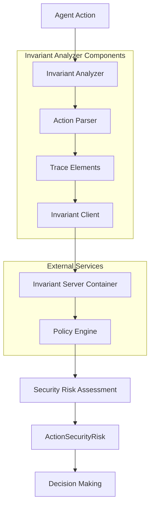
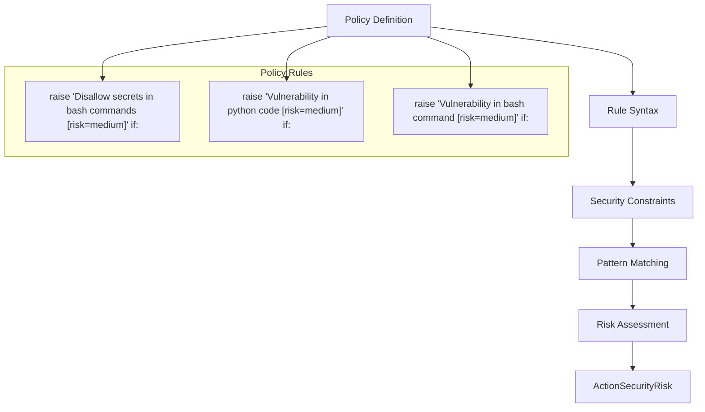
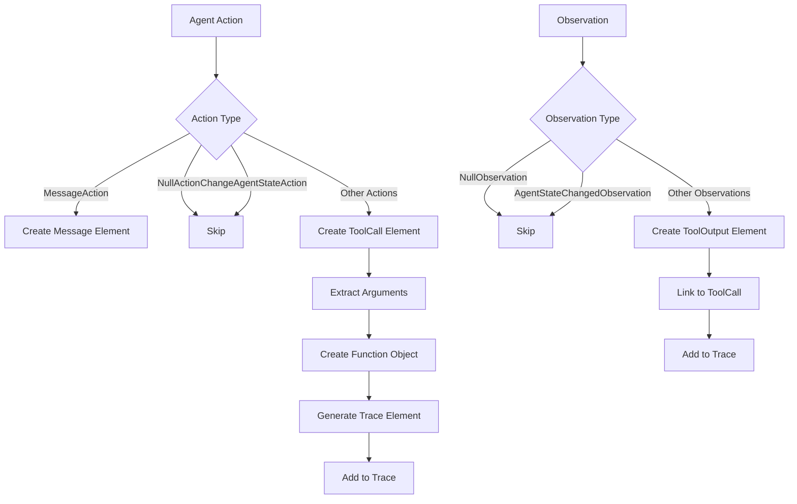
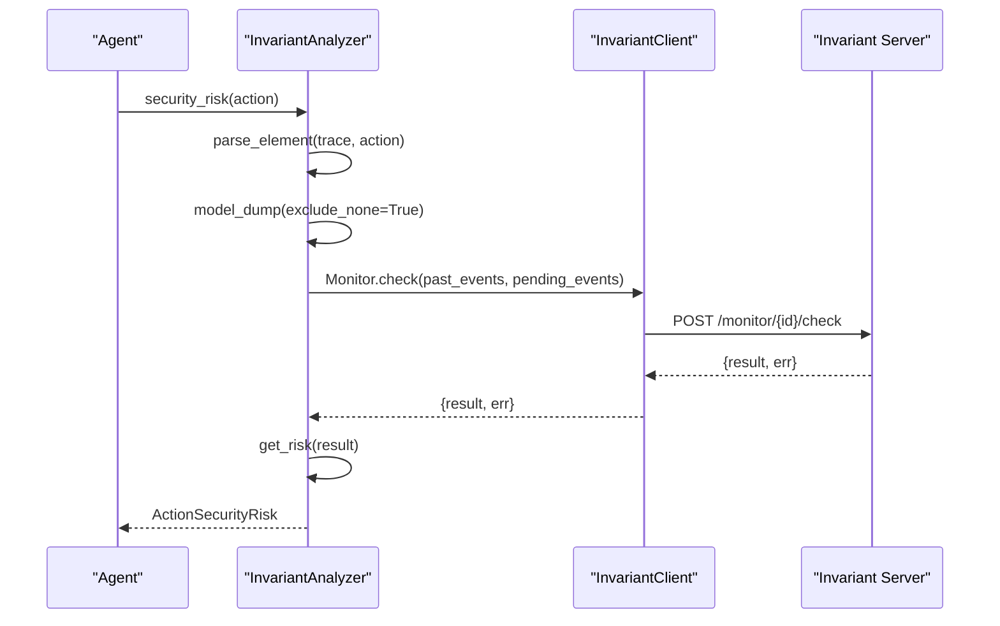

# Invariant Analyzer

<cite>
**Referenced Files in This Document**   
- [analyzer.py](file://openhands/security/invariant/analyzer.py)
- [client.py](file://openhands/security/invariant/client.py)
- [parser.py](file://openhands/security/invariant/parser.py)
- [nodes.py](file://openhands/security/invariant/nodes.py)
- [policies.py](file://openhands/security/invariant/policies.py)
- [security.py](file://tests/unit/security/test_security.py)
- [invariant-service.ts](file://frontend/src/api/invariant-service.ts)
- [public.py](file://openhands/server/routes/public.py)
- [options.py](file://openhands/security/options.py)
</cite>

## Table of Contents
1. [Introduction](#introduction)
2. [Architecture Overview](#architecture-overview)
3. [Core Components](#core-components)
4. [Policy Definition and Rule-Based Analysis](#policy-definition-and-rule-based-analysis)
5. [Action Parsing and Trace Processing](#action-parsing-and-trace-processing)
6. [Integration with Security Framework](#integration-with-security-framework)
7. [Configuration and API Endpoints](#configuration-and-api-endpoints)
8. [Performance Considerations](#performance-considerations)
9. [Troubleshooting Guide](#troubleshooting-guide)
10. [Conclusion](#conclusion)

## Introduction
The Invariant Analyzer is a security component within the OpenHands framework that validates agent actions against predefined security constraints using rule-based policies. It operates as a security analyzer that intercepts agent actions, parses them into a structured trace format, and evaluates them against configurable security policies. The analyzer leverages the Invariant platform to perform static analysis on agent behavior, identifying potential security risks in code execution, command execution, and other agent activities. This document provides a comprehensive analysis of the Invariant Analyzer's architecture, implementation, and integration within the OpenHands security framework.

## Architecture Overview

**Diagram sources**
- [analyzer.py](file://openhands/security/invariant/analyzer.py#L15-L125)
- [client.py](file://openhands/security/invariant/client.py#L7-L140)
- [parser.py](file://openhands/security/invariant/parser.py#L1-L103)

**Section sources**
- [analyzer.py](file://openhands/security/invariant/analyzer.py#L1-L125)
- [client.py](file://openhands/security/invariant/client.py#L1-L140)

## Core Components

The Invariant Analyzer consists of several core components that work together to provide security analysis for agent actions. The main component is the `InvariantAnalyzer` class, which inherits from the base `SecurityAnalyzer` class and implements the security analysis functionality. This class manages the lifecycle of the Invariant server container, handles policy configuration, and processes agent actions through the analysis pipeline. The analyzer communicates with an external Invariant server running in a Docker container, which performs the actual policy evaluation. The component also includes a sophisticated parsing system that converts agent actions and observations into a structured trace format compatible with the Invariant platform.

**Section sources**
- [analyzer.py](file://openhands/security/invariant/analyzer.py#L15-L125)
- [nodes.py](file://openhands/security/invariant/nodes.py#L1-L50)

## Policy Definition and Rule-Based Analysis

**Diagram sources**
- [policies.py](file://openhands/security/invariant/policies.py#L1-L20)
- [analyzer.py](file://openhands/security/invariant/analyzer.py#L83-L87)

The Invariant Analyzer uses a rule-based policy system to validate agent actions against security constraints. The policy rules are defined using a domain-specific language that allows for expressive security constraints. Each rule follows a pattern of "raise [message] if: [conditions]" where the conditions specify the circumstances under which a security risk should be identified. The policy engine supports various detectors such as `secrets` for identifying sensitive information and `semgrep` for code vulnerability detection. The rules can target specific action types like `cmd_run` for shell commands or `ipython_run_cell` for Python code execution. The risk level (high, medium, low) is specified in the rule message using the syntax `[risk=level]`, which is parsed by the analyzer to determine the appropriate security risk level.

**Section sources**
- [policies.py](file://openhands/security/invariant/policies.py#L1-L20)
- [analyzer.py](file://openhands/security/invariant/analyzer.py#L92-L108)

## Action Parsing and Trace Processing

**Diagram sources**
- [parser.py](file://openhands/security/invariant/parser.py#L39-L82)
- [nodes.py](file://openhands/security/invariant/nodes.py#L1-L50)

The Invariant Analyzer processes agent actions through a sophisticated parsing system that converts them into a standardized trace format. The parsing process begins with the `parse_element` function, which determines whether the input is an Action or Observation and routes it to the appropriate parsing function. For actions, the `parse_action` function creates Message elements for user and assistant messages, and ToolCall elements for executable actions. The function extracts relevant information such as the action type, arguments, and thought process, structuring it according to the Invariant platform's requirements. For observations, the `parse_observation` function creates ToolOutput elements that capture the results of executed actions. The parser maintains a trace of all elements, assigning unique IDs to tool calls and linking outputs to their corresponding calls.

**Section sources**
- [parser.py](file://openhands/security/invariant/parser.py#L22-L82)
- [analyzer.py](file://openhands/security/invariant/analyzer.py#L112-L116)

## Integration with Security Framework

**Diagram sources**
- [analyzer.py](file://openhands/security/invariant/analyzer.py#L110-L125)
- [client.py](file://openhands/security/invariant/client.py#L126-L139)

The Invariant Analyzer integrates with the OpenHands security framework through the `SecurityAnalyzer` base class interface. It implements the `security_risk` method, which is called by the agent controller to evaluate each action before execution. The analyzer maintains a running trace of actions and observations, which provides context for policy evaluation. When a new action is evaluated, the analyzer parses it into trace elements, sends both the historical trace and the new elements to the Invariant server for analysis, and interprets the results to determine the appropriate security risk level. The analyzer is registered in the `SecurityAnalyzers` dictionary in `options.py`, making it available as a selectable security option in the system configuration. The integration allows for dynamic enabling and disabling of the analyzer based on user preferences and security policies.

**Section sources**
- [analyzer.py](file://openhands/security/invariant/analyzer.py#L110-L125)
- [options.py](file://openhands/security/options.py#L6-L10)
- [test_security.py](file://tests/unit/security/test_security.py#L31)

## Configuration and API Endpoints

The Invariant Analyzer provides several configuration options and API endpoints for managing security policies and settings. The analyzer can be configured with a custom policy string during initialization, or it will retrieve a default template policy from the Invariant server. The frontend interface provides API endpoints for retrieving and updating the security policy, allowing users to modify rules through the web interface. The `/api/security/policy` endpoint enables getting and setting the current policy, while `/api/security/settings` manages risk severity thresholds. The analyzer also supports exporting trace data through the `/api/security/export-trace` endpoint for auditing and analysis purposes. Configuration can be managed both through the web interface and programmatically via API calls, providing flexibility for different deployment scenarios.

**Section sources**
- [invariant-service.ts](file://frontend/src/api/invariant-service.ts#L1-L30)
- [analyzer.py](file://openhands/security/invariant/analyzer.py#L25-L34)
- [public.py](file://openhands/server/routes/public.py#L47-L59)

## Performance Considerations

The Invariant Analyzer's performance is influenced by several factors, including the complexity of policy rules, the volume of agent actions, and the overhead of inter-process communication with the Invariant server container. The analyzer creates and manages a Docker container for the Invariant server, which introduces startup latency but provides isolation and consistency. The parsing of actions into trace elements is performed in-memory and is generally efficient, but the HTTP communication with the Invariant server for policy evaluation represents the primary performance bottleneck. The analyzer implements batching of input data to minimize the number of server requests, and maintains a persistent connection to the server for the duration of the session. For high-throughput scenarios, the performance can be optimized by simplifying policy rules, reducing the frequency of security checks, or implementing caching mechanisms for common action patterns.

**Section sources**
- [analyzer.py](file://openhands/security/invariant/analyzer.py#L67-L82)
- [client.py](file://openhands/security/invariant/client.py#L126-L139)

## Troubleshooting Guide

Common issues with the Invariant Analyzer typically relate to Docker container management, policy configuration, and network connectivity. If the analyzer fails to initialize, the most common cause is Docker not running or insufficient permissions to create containers. The error message specifically directs users to check that Docker is running or to disable the Security Analyzer in settings. Policy-related issues may occur when rules are malformed or when the Invariant server returns parsing errors, which are logged with appropriate warnings. Network connectivity problems between the analyzer and the Invariant server can occur if ports are blocked or if the server takes longer than expected to start. The analyzer includes timeout mechanisms and retry logic to handle transient issues, but persistent problems may require manual intervention such as restarting the container or verifying network configuration. Monitoring logs for messages from the `openhands_logger` can provide valuable insights into the analyzer's operation and help diagnose issues.

**Section sources**
- [analyzer.py](file://openhands/security/invariant/analyzer.py#L37-L44)
- [analyzer.py](file://openhands/security/invariant/analyzer.py#L67-L75)
- [analyzer.py](file://openhands/security/invariant/analyzer.py#L120-L123)

## Conclusion
The Invariant Analyzer provides a robust security framework for validating agent actions against predefined policies in the OpenHands system. By leveraging rule-based analysis and external policy evaluation, it offers a flexible and extensible approach to agent security. The analyzer's architecture effectively separates policy definition from execution, allowing for sophisticated security constraints while maintaining integration with the core agent functionality. Through its comprehensive parsing system, the analyzer can interpret various action types and observations, providing context-aware security analysis. The integration with the Invariant platform enables advanced detection capabilities, including code vulnerability scanning and secrets detection. While the current implementation has some performance considerations due to container management and inter-process communication, it provides a solid foundation for secure agent operation that can be extended and optimized for specific use cases.