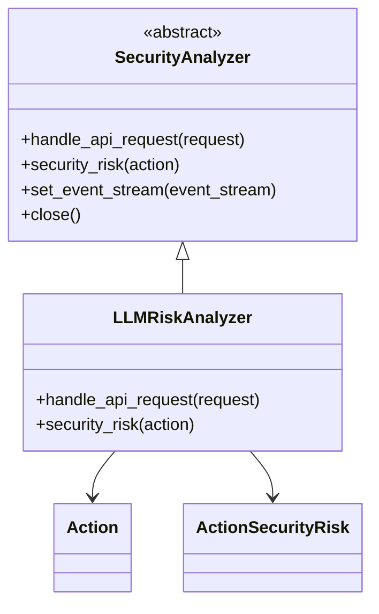
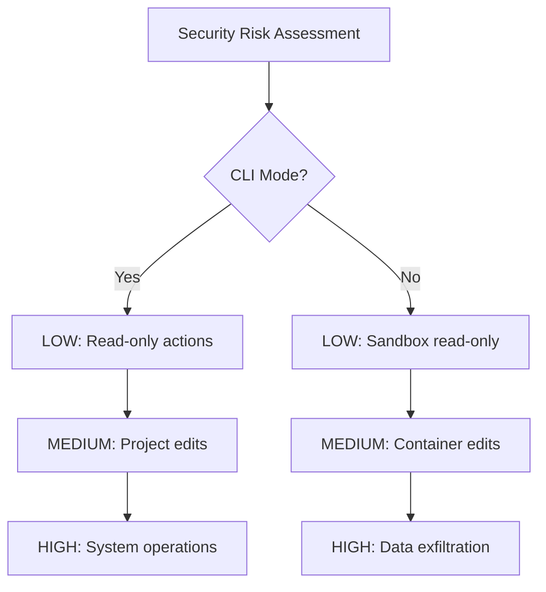
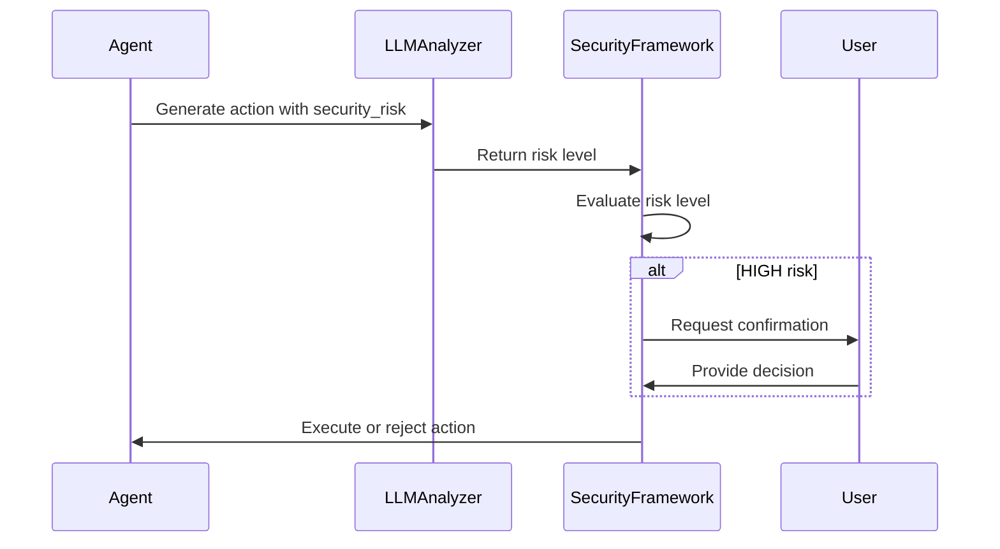

# LLM Analyzer

<cite>
**Referenced Files in This Document**   
- [analyzer.py](file://openhands/security/llm/analyzer.py)
- [security_utils.py](file://openhands/agenthub/codeact_agent/tools/security_utils.py)
- [security_risk_assessment.j2](file://containers/runtime/code/openhands/agenthub/codeact_agent/prompts/security_risk_assessment.j2)
- [action.py](file://openhands/events/action/action.py)
- [options.py](file://openhands/security/options.py)
</cite>

## Table of Contents
1. [Introduction](#introduction)
2. [Architecture Overview](#architecture-overview)
3. [Risk Assessment Implementation](#risk-assessment-implementation)
4. [Security Risk Levels](#security-risk-levels)
5. [Integration with Security Framework](#integration-with-security-framework)
6. [Configuration and Customization](#configuration-and-customization)
7. [Decision-Making Process](#decision-making-process)
8. [Performance and Tuning](#performance-and-tuning)
9. [Conclusion](#conclusion)

## Introduction

The LLM Analyzer is a security component within the OpenHands framework that leverages language models to assess the safety and risk level of agent actions before execution. It serves as the default security analyzer, utilizing LLM-provided risk assessments to determine whether actions should proceed, require confirmation, or be rejected. The analyzer operates by checking for a `security_risk` attribute set by the LLM when generating actions, allowing for intelligent risk assessment based on the context and content of each action.

This documentation provides a comprehensive overview of the LLM Analyzer's architecture, implementation, and integration within the OpenHands security framework. It details how the analyzer processes action content, generates risk scores, and makes approval/rejection decisions, with specific examples from the codebase showing how different action types are evaluated.

## Architecture Overview

The LLM Analyzer follows a straightforward architecture that integrates with the OpenHands security framework through a well-defined interface. The core component is the `LLMRiskAnalyzer` class, which implements the `SecurityAnalyzer` interface and provides the primary risk assessment functionality.



**Diagram sources**
- [analyzer.py](file://openhands/security/llm/analyzer.py)
- [action.py](file://openhands/events/action/action.py)

**Section sources**
- [analyzer.py](file://openhands/security/llm/analyzer.py)
- [options.py](file://openhands/security/options.py)

## Risk Assessment Implementation

The LLM Analyzer's risk assessment implementation is centered around the `security_risk` method in the `LLMRiskAnalyzer` class. This method evaluates actions by checking for the presence of a `security_risk` attribute that has been set by the LLM during action generation.

```python
async def security_risk(self, action: Action) -> ActionSecurityRisk:
    """Evaluates the Action for security risks and returns the risk level.
    
    This analyzer checks if the action has a 'security_risk' attribute set by the LLM.
    If it does, it uses that value. Otherwise, it returns UNKNOWN.
    """
    # Check if the action has a security_risk attribute set by the LLM
    if not hasattr(action, 'security_risk'):
        return ActionSecurityRisk.UNKNOWN
        
    security_risk = getattr(action, 'security_risk')
    
    if security_risk in {
        ActionSecurityRisk.LOW,
        ActionSecurityRisk.MEDIUM,
        ActionSecurityRisk.HIGH,
    }:
        return security_risk
    elif security_risk == ActionSecurityRisk.UNKNOWN:
        return ActionSecurityRisk.UNKNOWN
    else:
        # Default to UNKNOWN if security_risk value is not recognized
        logger.warning(f'Unrecognized security_risk value: {security_risk}')
        return ActionSecurityRisk.UNKNOWN
```

The implementation is lightweight and efficient, with no external dependencies. It simply checks for the presence of the `security_risk` attribute on the action object and maps it to the appropriate `ActionSecurityRisk` enum value. If the attribute is not present or contains an unrecognized value, it defaults to `UNKNOWN`.

**Section sources**
- [analyzer.py](file://openhands/security/llm/analyzer.py)

## Security Risk Levels

The LLM Analyzer uses a three-tier risk classification system: LOW, MEDIUM, and HIGH. These risk levels are defined in the system prompt and guide the LLM's assessment of action safety. The risk levels are implemented as an enum in the `ActionSecurityRisk` class:

```python
class ActionSecurityRisk(int, Enum):
    UNKNOWN = -1
    LOW = 0
    MEDIUM = 1
    HIGH = 2
```

The specific definitions of these risk levels vary depending on whether the agent is operating in CLI mode or within a sandbox environment:



For CLI mode:
- **LOW**: Safe, read-only actions such as viewing/summarizing content, reading project files, or simple in-memory calculations
- **MEDIUM**: Project-scoped edits or execution including modifying user project files, running project scripts/tests, or installing project-local packages
- **HIGH**: System-level or untrusted operations such as changing system settings, global installs, elevated (sudo) commands, deleting critical files, downloading & executing untrusted code, or sending local secrets/data out

For sandbox mode:
- **LOW**: Read-only actions inside the sandbox such as inspecting container files, calculations, or viewing docs
- **MEDIUM**: Container-scoped edits and installs including modifying workspace files, installing packages system-wide inside the container, or running user code
- **HIGH**: Data exfiltration or privilege breaks such as sending secrets/local data out, connecting to host filesystem, privileged container operations, or running unverified binaries with network access

A global rule applies: any action that involves sensitive data leaving the environment must be escalated to HIGH risk.

**Diagram sources**
- [security_risk_assessment.j2](file://containers/runtime/code/openhands/agenthub/codeact_agent/prompts/security_risk_assessment.j2)

**Section sources**
- [security_risk_assessment.j2](file://containers/runtime/code/openhands/agenthub/codeact_agent/prompts/security_risk_assessment.j2)
- [action.py](file://openhands/events/action/action.py)

## Integration with Security Framework

The LLM Analyzer integrates seamlessly with the OpenHands security framework through the `SecurityAnalyzers` registry. This registry maps analyzer names to their corresponding classes, allowing for easy configuration and switching between different security analyzers.

```python
SecurityAnalyzers: dict[str, type[SecurityAnalyzer]] = {
    'invariant': InvariantAnalyzer,
    'llm': LLMRiskAnalyzer,
    'grayswan': GraySwanAnalyzer,
}
```

The integration follows a clear pipeline:
1. The agent generates an action with a `security_risk` attribute based on the system prompt guidelines
2. The action is passed to the security framework for risk assessment
3. The LLM Analyzer checks for the `security_risk` attribute and returns the appropriate risk level
4. The security framework uses this risk level to determine whether to proceed with the action, require confirmation, or reject it

The analyzer also integrates with the confirmation system, where HIGH-risk actions automatically require user confirmation, while MEDIUM and LOW-risk actions respect the current confirmation mode settings.



**Diagram sources**
- [options.py](file://openhands/security/options.py)
- [analyzer.py](file://openhands/security/llm/analyzer.py)

**Section sources**
- [options.py](file://openhands/security/options.py)
- [analyzer.py](file://openhands/security/llm/analyzer.py)

## Configuration and Customization

The LLM Analyzer can be configured through the security framework settings, with 'llm' being the default analyzer. The configuration is straightforward and requires no additional setup beyond selecting the analyzer type.

Customization of the risk assessment process primarily occurs through the system prompt, specifically the `security_risk_assessment.j2` template. This template defines the risk level definitions and guidelines that the LLM follows when assessing action safety. The template includes conditional logic to provide different risk definitions based on whether the agent is operating in CLI mode or within a sandbox environment.

The risk assessment prompt is designed to be clear and specific, providing concrete examples for each risk level to guide the LLM's decision-making. This approach ensures consistent risk assessments across different action types and contexts.

To customize the risk assessment process, developers can:
1. Modify the risk level definitions in the `security_risk_assessment.j2` template
2. Adjust the global rules for escalating risk levels
3. Add new risk categories or modify existing ones
4. Update the examples provided for each risk level

These customizations directly influence how the LLM evaluates actions and assigns risk levels, which in turn affects the behavior of the LLM Analyzer.

**Section sources**
- [security_risk_assessment.j2](file://containers/runtime/code/openhands/agenthub/codeact_agent/prompts/security_risk_assessment.j2)
- [options.py](file://openhands/security/options.py)

## Decision-Making Process

The LLM Analyzer's decision-making process is straightforward and deterministic. It follows a simple algorithm to determine the risk level of an action:

```mermaid
flowchart TD
A[Start] --> B{Action has security_risk attribute?}
B --> |No| C[Return UNKNOWN]
B --> |Yes| D[Get security_risk value]
D --> E{Value in [LOW, MEDIUM, HIGH, UNKNOWN]?}
E --> |Yes| F[Return mapped value]
E --> |No| G[Log warning]
G --> H[Return UNKNOWN]
```

The process begins by checking if the action has a `security_risk` attribute. If not, the analyzer returns `UNKNOWN`. If the attribute exists, it retrieves the value and checks if it matches one of the valid risk levels (LOW, MEDIUM, HIGH, or UNKNOWN). If the value is valid, it returns the corresponding `ActionSecurityRisk` enum value. If the value is not recognized, it logs a warning and returns `UNKNOWN`.

This decision-making process is designed to be robust and fault-tolerant. By defaulting to `UNKNOWN` for unrecognized values, it ensures that actions with ambiguous risk assessments are treated with appropriate caution. The warning log provides visibility into any issues with risk level assignments, allowing for debugging and improvement of the LLM's risk assessment capabilities.

The analyzer's simplicity is a key feature, as it focuses on interpreting the LLM's risk assessment rather than performing its own analysis. This separation of concerns allows the LLM to leverage its language understanding capabilities for risk assessment while the analyzer provides a reliable interface to the security framework.

**Diagram sources**
- [analyzer.py](file://openhands/security/llm/analyzer.py)

**Section sources**
- [analyzer.py](file://openhands/security/llm/analyzer.py)

## Performance and Tuning

The LLM Analyzer is designed to be lightweight and efficient, with minimal performance overhead. Since it primarily performs attribute checking and value mapping, its computational requirements are negligible compared to other components in the system.

The primary performance consideration is not the analyzer itself, but rather the quality of the LLM's risk assessments. Poor risk assessments from the LLM can lead to false positives (overly conservative blocking of safe actions) or false negatives (failure to identify genuinely risky actions).

To tune the analyzer's sensitivity, developers can:
1. Refine the risk level definitions in the system prompt
2. Adjust the examples provided for each risk level
3. Modify the global rules for escalating risk levels
4. Implement additional validation on the LLM's risk assessments

Strategies for reducing false positives include:
- Providing more specific examples in the risk level definitions
- Clarifying the boundaries between risk levels
- Adding context-specific guidelines for common action types
- Implementing post-processing rules to adjust risk levels based on action parameters

The analyzer's performance can also be improved by ensuring that the LLM is properly trained or prompted to provide accurate risk assessments. This may involve fine-tuning the LLM on security-related tasks or providing more comprehensive guidance in the system prompt.

**Section sources**
- [analyzer.py](file://openhands/security/llm/analyzer.py)
- [security_risk_assessment.j2](file://containers/runtime/code/openhands/agenthub/codeact_agent/prompts/security_risk_assessment.j2)

## Conclusion

The LLM Analyzer provides a lightweight yet effective approach to security risk assessment in the OpenHands framework. By leveraging the LLM's understanding of action context and content, it enables intelligent risk evaluation that goes beyond simple pattern matching or rule-based systems.

The analyzer's architecture is simple and efficient, focusing on interpreting the LLM's risk assessments rather than performing its own analysis. This separation of concerns allows the system to benefit from the LLM's language understanding capabilities while maintaining a reliable security interface.

Key strengths of the LLM Analyzer include:
- Seamless integration with the agent's decision-making process
- Context-aware risk assessment based on action content
- Lightweight implementation with minimal performance overhead
- Clear risk level definitions that guide the LLM's assessments
- Flexible configuration through the security framework

The analyzer can be customized and tuned by modifying the risk assessment prompt, allowing developers to adapt it to specific use cases and security requirements. Its effectiveness ultimately depends on the quality of the LLM's risk assessments, highlighting the importance of clear guidelines and examples in the system prompt.

Overall, the LLM Analyzer represents a practical approach to balancing security and autonomy in AI agent systems, enabling safe execution of actions while minimizing unnecessary interruptions for user confirmation.