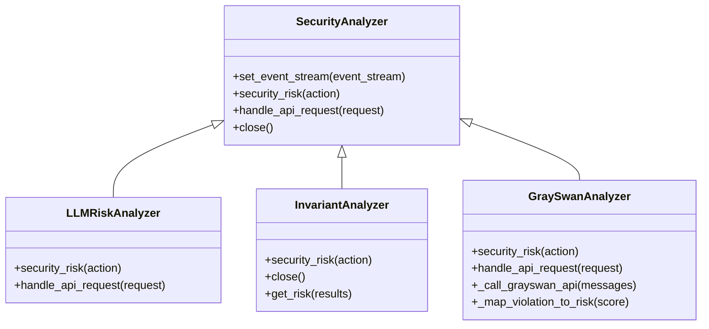
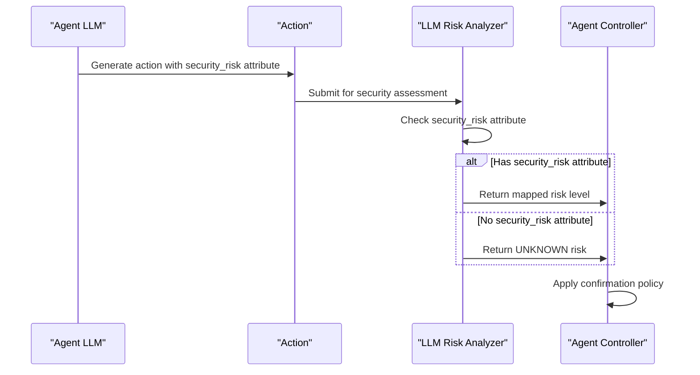
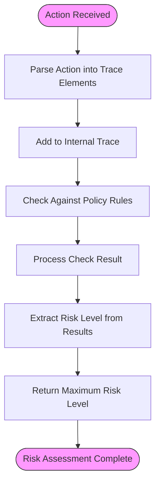
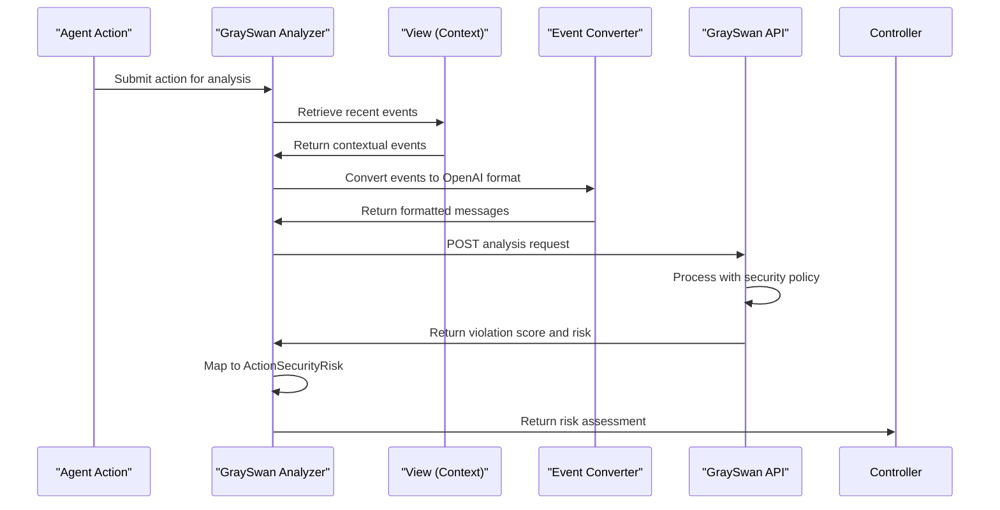
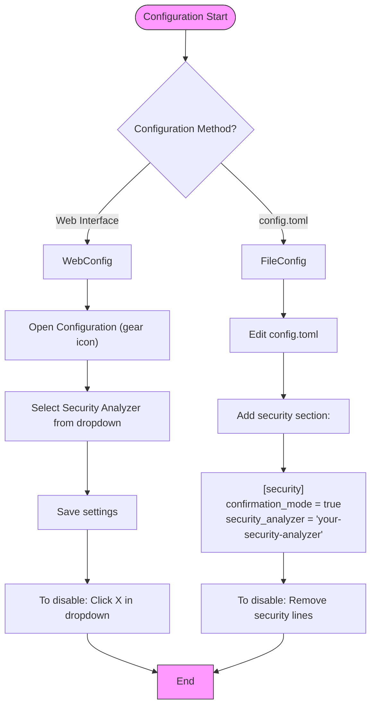
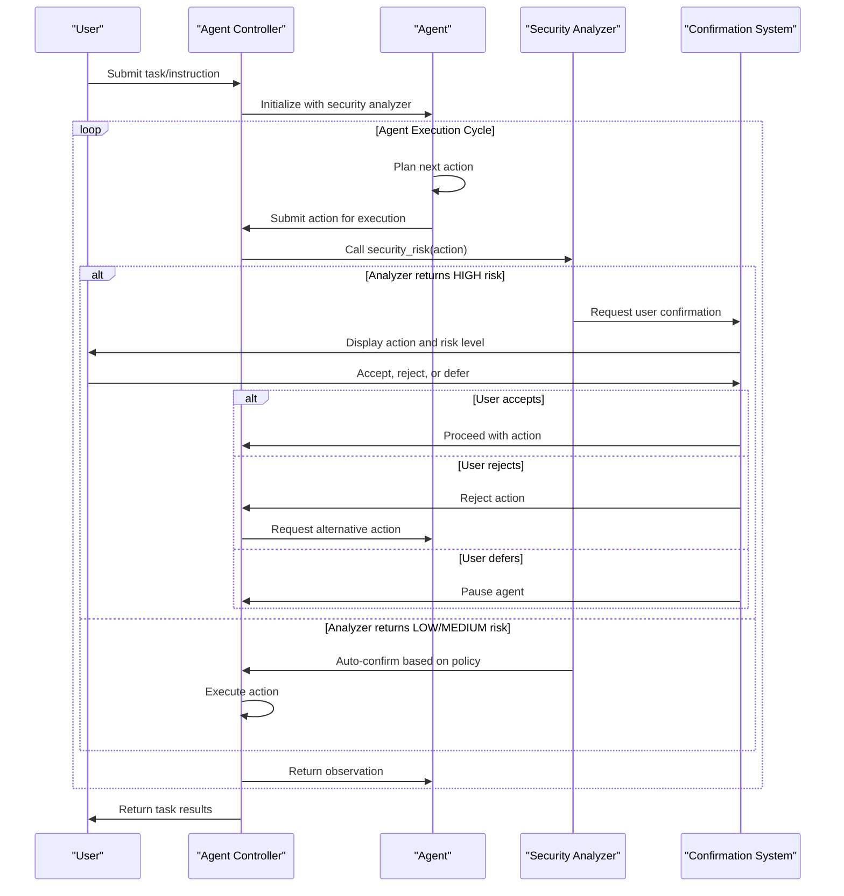

# Security Analyzers

<cite>
**Referenced Files in This Document**   
- [analyzer.py](file://openhands/security/analyzer.py)
- [options.py](file://openhands/security/options.py)
- [llm/analyzer.py](file://openhands/security/llm/analyzer.py)
- [invariant/analyzer.py](file://openhands/security/invariant/analyzer.py)
- [grayswan/analyzer.py](file://openhands/security/grayswan/analyzer.py)
- [grayswan/utils.py](file://openhands/security/grayswan/utils.py)
- [invariant/parser.py](file://openhands/security/invariant/parser.py)
- [invariant/client.py](file://openhands/security/invariant/client.py)
- [action.py](file://openhands/events/action/action.py)
</cite>

## Table of Contents
1. [Introduction](#introduction)
2. [Security Analyzer Architecture](#security-analyzer-architecture)
3. [LLM Analyzer](#llm-analyzer)
4. [Invariant Analyzer](#invariant-analyzer)
5. [GraySwan Analyzer](#grayswan-analyzer)
6. [Analyzer Configuration](#analyzer-configuration)
7. [Integration with Agent Controller](#integration-with-agent-controller)
8. [Common Issues and Tuning](#common-issues-and-tuning)
9. [Conclusion](#conclusion)

## Introduction

The Security Analyzers component in OpenHands provides a comprehensive framework for inspecting agent actions for potential security risks. This system implements a layered security approach through three distinct analyzer types: LLM-based, Invariant, and GraySwan. Each analyzer type employs different techniques to assess the safety of agent actions, from file operations to command execution, providing complementary protection mechanisms.

The security framework is designed to prevent unintended actions or security breaches while allowing agents to operate autonomously. Security analyzers integrate with the agent controller to evaluate actions before execution, enabling confirmation prompts for risky operations based on configurable policies. This documentation explains the purpose, architecture, and implementation details of each analyzer type, their configuration options, strengths, limitations, and how they work together in a comprehensive security strategy.

**Section sources**
- [analyzer.py](file://openhands/security/analyzer.py#L1-L38)
- [options.py](file://openhands/security/options.py#L1-L11)

## Security Analyzer Architecture

The Security Analyzer framework follows a modular architecture with a base class that defines the common interface for all analyzer implementations. The `SecurityAnalyzer` base class serves as an abstract foundation that all specific analyzers inherit from, ensuring consistent behavior across different security analysis approaches.

**Diagram sources**
- [analyzer.py](file://openhands/security/analyzer.py#L8-L38)
- [llm/analyzer.py](file://openhands/security/llm/analyzer.py#L12-L43)
- [invariant/analyzer.py](file://openhands/security/invariant/analyzer.py#L15-L126)
- [grayswan/analyzer.py](file://openhands/security/grayswan/analyzer.py#L18-L204)

The architecture enables pluggable security analysis through the `SecurityAnalyzers` registry in `options.py`, which maps analyzer names to their respective classes. This design allows users to select different analyzer types based on their security requirements and operational constraints.

The framework supports three primary analyzer types that work together to provide comprehensive security coverage:
- **LLM Analyzer**: Leverages the agent's own LLM to assess action risks
- **Invariant Analyzer**: Applies rule-based security policies through external analysis
- **GraySwan Analyzer**: Uses external AI safety monitoring via API integration

Each analyzer implements the `security_risk` method to evaluate actions and return an `ActionSecurityRisk` level (LOW, MEDIUM, HIGH, or UNKNOWN). The base class also defines methods for handling API requests, setting the event stream for context access, and cleaning up resources.

**Section sources**
- [analyzer.py](file://openhands/security/analyzer.py#L8-L38)
- [options.py](file://openhands/security/options.py#L6-L10)

## LLM Analyzer

The LLM Risk Analyzer is the default security analyzer that leverages the agent's language model to assess action safety. This analyzer respects the `security_risk` attribute that can be set by the LLM when generating actions, allowing for intelligent risk assessment based on the context and content of each action.

**Diagram sources**
- [llm/analyzer.py](file://openhands/security/llm/analyzer.py#L12-L43)
- [action.py](file://openhands/events/action/action.py#L14-L18)

The LLM Risk Analyzer implementation is lightweight and efficient, with no external dependencies. It checks if actions have a `security_risk` attribute set by the LLM and maps it to the appropriate `ActionSecurityRisk` level. If no risk assessment is provided, it defaults to UNKNOWN. The analyzer supports three risk levels: LOW, MEDIUM, and HIGH, which correspond to different confirmation requirements based on the user's configuration.

Key features of the LLM Risk Analyzer include:
- Uses LLM-provided risk assessments for intelligent context-aware evaluation
- Automatically requires confirmation for HIGH-risk actions
- Respects confirmation mode settings for MEDIUM and LOW-risk actions
- Lightweight and efficient with no external dependencies
- Integrates seamlessly with the agent's decision-making process

The analyzer is particularly effective for assessing risks that require understanding of the agent's internal reasoning and context. However, it has limitations in that it relies on the LLM's self-assessment capabilities, which may not catch all potential security issues, especially those that the LLM itself might be attempting to conceal.

**Section sources**
- [llm/analyzer.py](file://openhands/security/llm/analyzer.py#L1-L43)
- [action.py](file://openhands/events/action/action.py#L14-L18)

## Invariant Analyzer

The Invariant Analyzer provides rule-based security policy enforcement by analyzing agent action traces for potential issues. It uses the Invariant platform to detect violations of security policies and requires user confirmation for potentially risky actions, allowing agents to operate autonomously while preventing harmful operations.

**Diagram sources**
- [invariant/analyzer.py](file://openhands/security/invariant/analyzer.py#L15-L126)
- [invariant/parser.py](file://openhands/security/invariant/parser.py#L39-L81)
- [invariant/client.py](file://openhands/security/invariant/client.py#L106-L140)

The Invariant Analyzer implementation involves several key components:
- **Docker container management**: The analyzer runs an Invariant server in a Docker container, automatically starting it if not already running
- **Trace parsing**: Actions are parsed into trace elements using the `parse_element` function, which converts OpenHands actions into a format compatible with the Invariant platform
- **Policy enforcement**: The analyzer uses the Invariant client to check actions against defined security policies, supporting both default templates and custom rules
- **Risk mapping**: The results from policy checks are processed to extract risk levels (high, medium, low) and return the maximum risk level found

The analyzer initializes by connecting to a Docker container running the Invariant server. If no container is running, it starts one using the `ghcr.io/invariantlabs-ai/server:openhands` image. It then establishes a connection to the server's API and sets up a monitor with either a custom policy or the default template.

For browsing agent safety, the Invariant Analyzer includes a guardrail feature that uses an LLM to examine user requests and agent inputs for harmful content. If either condition is detected as harmful, it emits a change_agent_state action to stop the agent from proceeding.

Strengths of the Invariant Analyzer include:
- Rule-based policy enforcement with customizable security rules
- External analysis independent of the agent's LLM
- Support for complex policy definitions and trace analysis
- Browsing agent safety guardrails for web interactions

Limitations include:
- Dependency on Docker for containerized execution
- Potential performance overhead from external API calls
- Complexity in defining and maintaining security policies

**Section sources**
- [invariant/analyzer.py](file://openhands/security/invariant/analyzer.py#L15-L126)
- [invariant/parser.py](file://openhands/security/invariant/parser.py#L39-L81)
- [invariant/client.py](file://openhands/security/invariant/client.py#L106-L140)

## GraySwan Analyzer

The GraySwan Analyzer integrates with Gray Swan AI's Cygnal API to provide advanced AI safety monitoring for OpenHands agents. This analyzer performs deep code analysis and risk assessment by sending agent actions and context to the external GraySwan service for comprehensive security evaluation.

**Diagram sources**
- [grayswan/analyzer.py](file://openhands/security/grayswan/analyzer.py#L18-L204)
- [grayswan/utils.py](file://openhands/security/grayswan/utils.py#L23-L146)

The GraySwan Analyzer implementation involves several key steps:
- **Context gathering**: The analyzer uses the `View` class to access the agent's conversation history, applying context management like trimming and summaries to get closer to what the agent's LLM actually sees
- **Message conversion**: Events are converted to OpenAI message format using the `convert_events_to_openai_messages` utility, which handles various event types including actions, observations, and tool calls
- **API integration**: The analyzer makes HTTP requests to the GraySwan API with the converted messages and receives a violation score and risk assessment
- **Risk mapping**: The violation score is mapped to an `ActionSecurityRisk` level using configurable thresholds (low, medium, high)

The analyzer requires two environment variables for operation:
- `GRAYSWAN_API_KEY`: Required API key for GraySwan authentication
- `GRAYSWAN_POLICY_ID`: Optional policy ID for custom GraySwan policy (defaults to a coding agent policy if not provided)

Key configuration options include:
- `history_limit`: Number of recent events to include as context (default: 20)
- `max_message_chars`: Maximum characters for conversation processing
- `timeout`: Request timeout in seconds (default: 30)
- `low_threshold`, `medium_threshold`, `high_threshold`: Risk thresholds for classification

The analyzer has special handling for indirect prompt injection (IPI), which is automatically escalated to HIGH risk regardless of the violation score. This provides an additional layer of protection against sophisticated attacks.

Strengths of the GraySwan Analyzer include:
- Advanced AI safety monitoring with specialized security policies
- Deep code analysis capabilities through external service
- Configurable risk thresholds for fine-tuned sensitivity
- Protection against indirect prompt injection
- Default policy for coding agents reduces setup complexity

Limitations include:
- Dependency on external API service and internet connectivity
- Potential latency from API calls
- Requires API key and account setup
- Limited control over the analysis algorithm itself

**Section sources**
- [grayswan/analyzer.py](file://openhands/security/grayswan/analyzer.py#L18-L204)
- [grayswan/utils.py](file://openhands/security/grayswan/utils.py#L23-L146)

## Analyzer Configuration

Security analyzers in OpenHands can be configured through multiple methods, allowing flexibility in deployment and security policy management. The configuration system supports both UI-based and file-based approaches, with options to enable, disable, or switch between different analyzer types.

**Diagram sources**
- [options.py](file://openhands/security/options.py#L6-L10)
- [README.md](file://openhands/security/README.md#L5-L20)

The primary configuration options for security analyzers include:
- **confirmation_mode**: Enables or disables confirmation mode globally
- **security_analyzer**: Specifies which analyzer to use (invariant, llm, or grayswan)

Each analyzer type has specific configuration requirements:
- **LLM Analyzer**: No additional configuration required; uses the LLM's self-assessment
- **Invariant Analyzer**: Can specify a custom policy string and session ID
- **GraySwan Analyzer**: Requires environment variables (GRAYSWAN_API_KEY, optional GRAYSWAN_POLICY_ID) and supports various initialization parameters

The configuration system allows for dynamic switching between analyzers and can be toggled during runtime. When confirmation mode is disabled, the security analyzer is removed from the conversation setup, allowing the agent to proceed without asking for confirmation on actions.

Analyzer selection is managed through the `SecurityAnalyzers` registry, which maps string identifiers to their corresponding classes. This design enables easy extension with new analyzer types by simply adding them to the registry.

**Section sources**
- [options.py](file://openhands/security/options.py#L6-L10)
- [README.md](file://openhands/security/README.md#L5-L20)

## Integration with Agent Controller

The security analyzers integrate with the agent controller through a well-defined pipeline that processes agent actions before execution. This integration enables real-time risk assessment and user confirmation for potentially risky operations, creating a layered security approach that complements the agent's autonomous capabilities.

**Diagram sources**
- [analyzer.py](file://openhands/security/analyzer.py#L21-L38)
- [agent.py](file://openhands/controller/agent.py#L105-L109)
- [runner.py](file://openhands-cli/openhands_cli/runner.py#L149-L178)

The integration process follows these key steps:
1. **Analyzer initialization**: The agent controller sets up the selected security analyzer and passes it the event stream for context access
2. **Action submission**: When the agent generates an action, it is submitted to the controller for processing
3. **Security assessment**: The controller calls the analyzer's `security_risk` method to evaluate the action
4. **Risk-based decision**: Based on the risk level returned, the system either auto-confirms (for LOW/MEDIUM) or requests user confirmation (for HIGH)
5. **Action execution**: If approved, the action is executed and the observation is returned to the agent
6. **Policy updates**: Users can modify confirmation policies during execution, such as switching to never confirm or risk-based confirmation

The integration supports various confirmation policies that can be changed dynamically:
- **Never confirm**: Disables security analysis and proceeds without asking
- **Confirm risky**: Auto-confirms LOW/MEDIUM risk actions, asks for HIGH risk actions
- **Always confirm**: Requests confirmation for all actions regardless of risk level

The system also handles edge cases such as timeouts, API errors, and unknown risk levels by defaulting to appropriate safety measures. For example, if an analyzer fails to return a valid risk assessment, the system treats it as UNKNOWN risk, which typically requires user confirmation.

This integration creates a flexible security framework that balances agent autonomy with user control, allowing for different security postures based on the specific use case and risk tolerance.

**Section sources**
- [analyzer.py](file://openhands/security/analyzer.py#L21-L38)
- [agent.py](file://openhands/controller/agent.py#L105-L109)
- [runner.py](file://openhands-cli/openhands_cli/runner.py#L149-L178)

## Common Issues and Tuning

The Security Analyzers component may encounter various issues in practice, ranging from false positives to performance overhead. Understanding these common issues and how to tune the analyzers is essential for effective deployment and operation.

### False Positives

False positives occur when legitimate actions are incorrectly flagged as risky. This is particularly common with:
- **LLM Analyzer**: When the LLM overestimates the risk of benign actions
- **Invariant Analyzer**: When security policies are too restrictive or poorly defined
- **GraySwan Analyzer**: When the external service's policy is overly conservative

To reduce false positives:
- Refine security policies to be more specific and context-aware
- Adjust risk thresholds in the GraySwan Analyzer
- Provide better system prompts to guide the LLM's risk assessment
- Use the browsing agent guardrail selectively based on use case

### Performance Overhead

Security analysis can introduce latency, especially with external API calls:
- **LLM Analyzer**: Minimal overhead as it only checks existing attributes
- **Invariant Analyzer**: Moderate overhead from Docker container communication
- **GraySwan Analyzer**: Significant overhead from external API calls and network latency

To optimize performance:
- Cache recent analysis results when appropriate
- Adjust the `history_limit` parameter to reduce context size
- Increase timeout values for slow networks
- Consider disabling analyzers for low-risk tasks

### Tuning Analyzer Sensitivity

Each analyzer type offers different tuning options:
- **LLM Analyzer**: Limited tuning as it depends on the LLM's self-assessment
- **Invariant Analyzer**: Tune by refining policy rules and thresholds
- **GraySwan Analyzer**: Configure thresholds (low, medium, high) and history limits

Best practices for tuning include:
- Start with conservative settings and gradually relax them
- Monitor false positive rates and adjust accordingly
- Use different analyzers for different task types
- Regularly review and update security policies

### Configuration and Setup Issues

Common setup problems include:
- Missing API keys for external services (GraySwan)
- Docker not running for Invariant Analyzer
- Incorrect policy definitions
- Environment variable configuration errors

Troubleshooting steps:
- Verify all required environment variables are set
- Check Docker service status for Invariant Analyzer
- Validate policy syntax and rules
- Review logs for specific error messages

By understanding these common issues and tuning options, users can effectively balance security requirements with operational efficiency, creating a robust yet practical security framework for their OpenHands deployment.

**Section sources**
- [grayswan/analyzer.py](file://openhands/security/grayswan/analyzer.py#L21-L45)
- [invariant/analyzer.py](file://openhands/security/invariant/analyzer.py#L25-L44)
- [llm/analyzer.py](file://openhands/security/llm/analyzer.py#L19-L24)

## Conclusion

The Security Analyzers component in OpenHands provides a comprehensive, layered approach to agent security through three distinct analyzer types: LLM-based, Invariant, and GraySwan. Each analyzer offers unique strengths and operates through different mechanisms, creating a robust security framework that can be tailored to specific use cases and risk tolerances.

The LLM Risk Analyzer leverages the agent's own language model to assess action risks, providing a lightweight and efficient solution that integrates seamlessly with the agent's decision-making process. The Invariant Analyzer applies rule-based security policies through external analysis, offering configurable protection with support for custom rules and browsing agent guardrails. The GraySwan Analyzer integrates with external AI safety monitoring services, providing advanced deep code analysis and protection against sophisticated threats like indirect prompt injection.

These analyzers work together in a complementary fashion, with the LLM analyzer providing context-aware self-assessment, the Invariant analyzer enforcing explicit security policies, and the GraySwan analyzer offering specialized AI safety monitoring. The modular architecture allows users to select and combine analyzers based on their specific security requirements, operational constraints, and performance considerations.

The integration with the agent controller creates a flexible security framework that balances agent autonomy with user control, supporting various confirmation policies that can be adjusted dynamically. This approach enables safe autonomous operation while providing safeguards against unintended actions or security breaches.

For optimal deployment, users should consider their specific risk profile, performance requirements, and operational constraints when configuring the security analyzers. Starting with conservative settings and gradually tuning sensitivity based on observed false positive rates and security needs is recommended. Regular review and updating of security policies and configurations will ensure ongoing protection as agent capabilities and threat landscapes evolve.