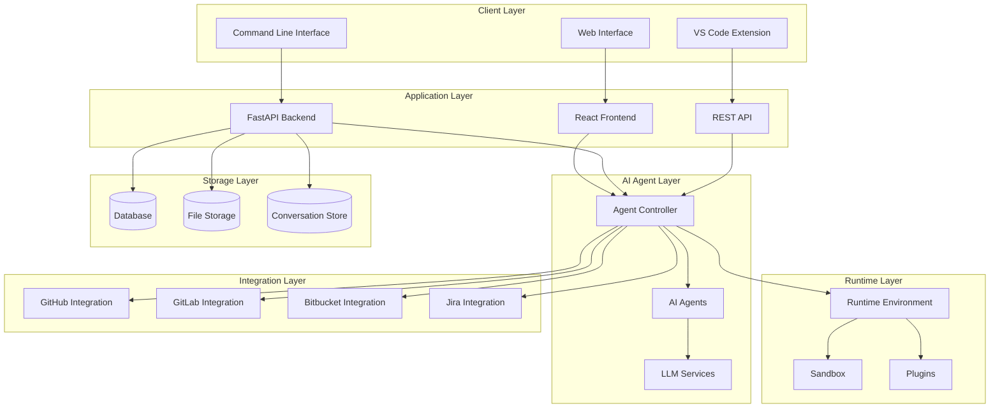
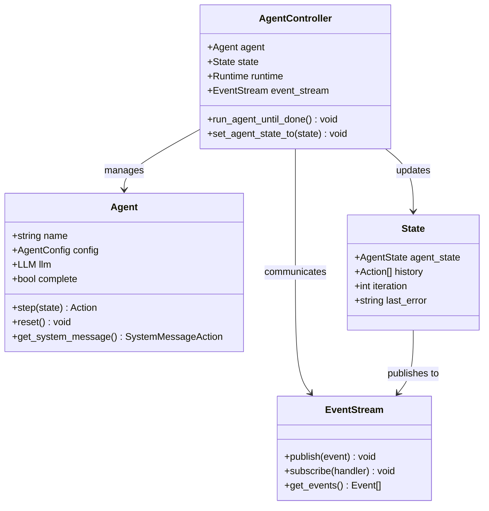
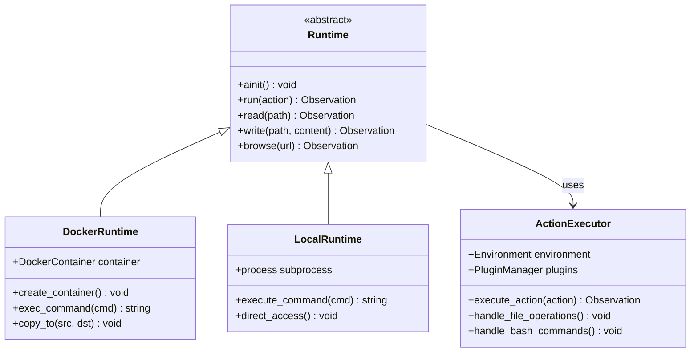
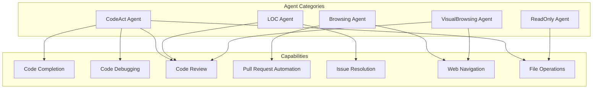
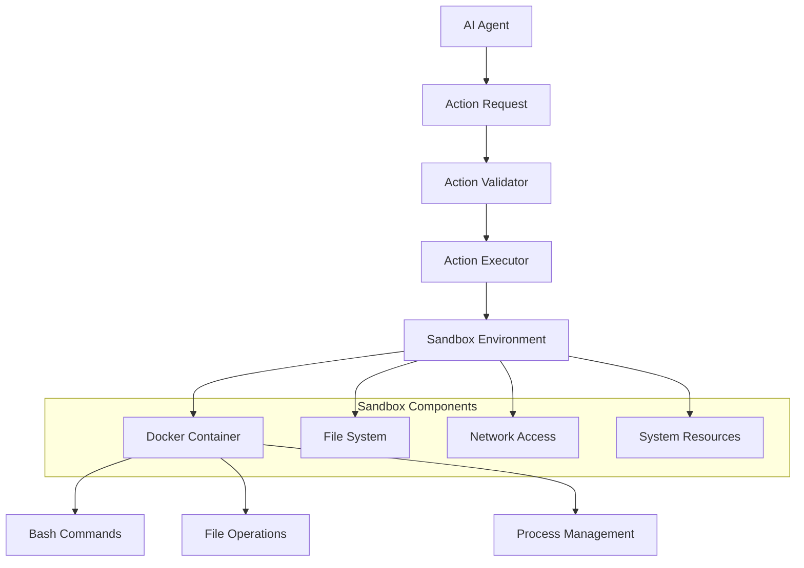
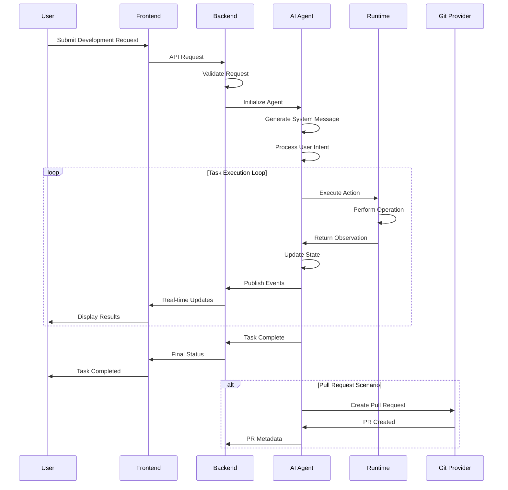
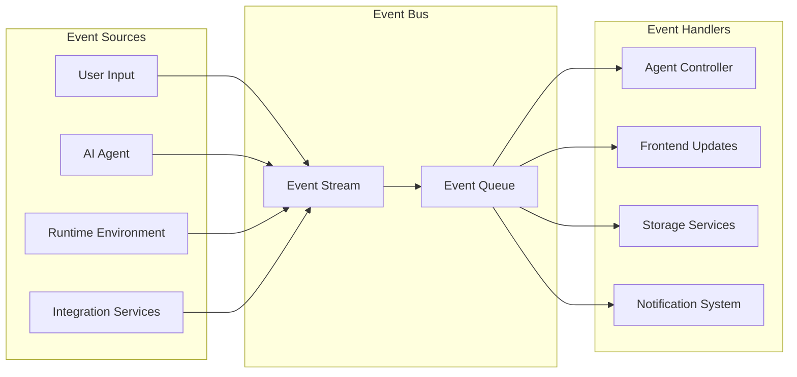
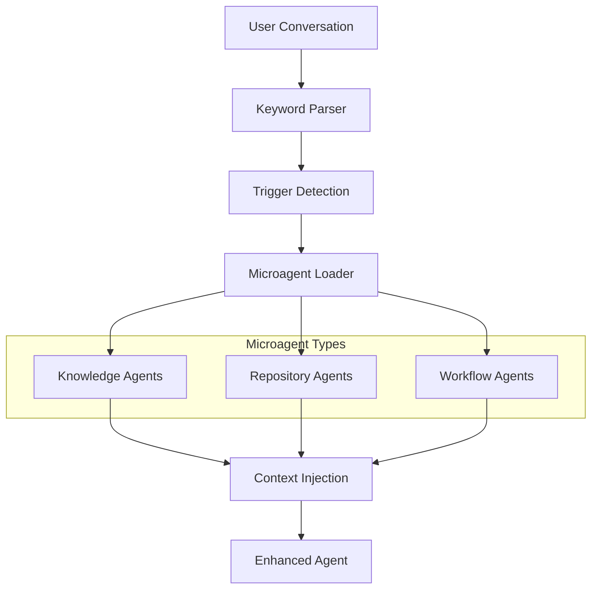
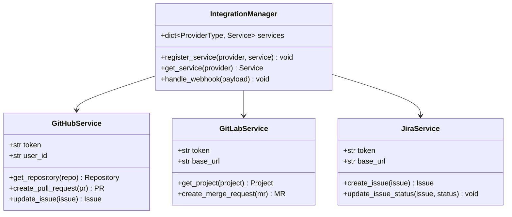

# System Overview

<cite>
**Referenced Files in This Document**
- [README.md](file://README.md)
- [openhands/README.md](file://openhands/README.md)
- [frontend/README.md](file://frontend/README.md)
- [enterprise/README.md](file://enterprise/README.md)
- [openhands/server/app.py](file://openhands/server/app.py)
- [openhands/controller/agent.py](file://openhands/controller/agent.py)
- [openhands/core/loop.py](file://openhands/core/loop.py)
- [openhands/runtime/README.md](file://openhands/runtime/README.md)
- [enterprise/integrations/github/github_service.py](file://enterprise/integrations/github/github_service.py)
- [openhands/resolver/resolve_issue.py](file://openhands/resolver/resolve_issue.py)
- [microagents/README.md](file://microagents/README.md)
- [microagents/add_agent.md](file://microagents/add_agent.md)
- [microagents/default-tools.md](file://microagents/default-tools.md)
</cite>

## Table of Contents
1. [Introduction](#introduction)
2. [Platform Purpose and Vision](#platform-purpose-and-vision)
3. [System Architecture Overview](#system-architecture-overview)
4. [Core Components](#core-components)
5. [Full-Stack Application Architecture](#full-stack-application-architecture)
6. [AI Agent System](#ai-agent-system)
7. [Runtime Environment](#runtime-environment)
8. [Integration Systems](#integration-systems)
9. [Common Use Cases](#common-use-cases)
10. [High-Level Workflow](#high-level-workflow)
11. [Component Interactions](#component-interactions)
12. [Technical Implementation Details](#technical-implementation-details)
13. [Conclusion](#conclusion)

## Introduction

OpenHands (formerly OpenDevin) is an innovative AI-powered development platform that revolutionizes software development through natural language interaction with code repositories. Built as a full-stack application, OpenHands enables developers to accomplish anything a human developer can do—modify code, run commands, browse the web, call APIs, and even copy code snippets from StackOverflow—all through intuitive natural language conversations.

The platform serves as a bridge between human developers and AI agents, transforming how teams approach development tasks by providing intelligent assistance for code navigation, issue resolution, pull request automation, and collaborative development workflows.

## Platform Purpose and Vision

OpenHands aims to democratize AI-assisted development by making sophisticated coding capabilities accessible to developers of all skill levels. The platform's core vision is to "Code Less, Make More" by empowering developers to achieve more with less manual effort through intelligent automation and guided assistance.

### Key Objectives

- **Natural Language Interaction**: Enable seamless communication with code repositories through conversational interfaces
- **Universal Developer Assistance**: Provide capabilities equivalent to human developers across all development scenarios
- **Intelligent Automation**: Automate repetitive tasks while maintaining developer control and oversight
- **Collaborative Development**: Enhance team productivity through AI-powered code review and issue resolution
- **Domain-Specific Expertise**: Deliver specialized knowledge through microagents for specific technologies and workflows

## System Architecture Overview

OpenHands employs a sophisticated multi-layered architecture that combines modern web technologies with advanced AI capabilities. The system is designed as a full-stack application with clear separation of concerns across frontend, backend, and runtime layers.

**Diagram sources**
- [openhands/server/app.py](file://openhands/server/app.py#L66-L96)
- [frontend/README.md](file://frontend/README.md#L8-L18)
- [openhands/runtime/README.md](file://openhands/runtime/README.md#L1-L50)

## Core Components

The OpenHands platform consists of several interconnected core components that work together to provide comprehensive AI-assisted development capabilities.

### Agent System

The agent system forms the cognitive core of OpenHands, responsible for understanding user intents and orchestrating development tasks.

**Diagram sources**
- [openhands/controller/agent.py](file://openhands/controller/agent.py#L25-L184)
- [openhands/core/loop.py](file://openhands/core/loop.py#L11-L46)

### Runtime Environment

The runtime environment provides isolated execution contexts for agent actions, ensuring safe and controlled operation of development tasks.

**Diagram sources**
- [openhands/runtime/README.md](file://openhands/runtime/README.md#L10-L50)

**Section sources**
- [openhands/README.md](file://openhands/README.md#L1-L56)
- [openhands/controller/agent.py](file://openhands/controller/agent.py#L1-L184)
- [openhands/runtime/README.md](file://openhands/runtime/README.md#L1-L162)

## Full-Stack Application Architecture

OpenHands implements a modern full-stack architecture combining contemporary web technologies with robust backend services.

### Frontend Architecture

The frontend is built as a React application using modern development tools and patterns:

- **Framework**: React with TypeScript for type-safe development
- **Build System**: Vite for fast development and optimized production builds
- **Routing**: React Router for client-side navigation
- **State Management**: Redux for centralized application state
- **API Communication**: TanStack Query for server state management
- **Styling**: Tailwind CSS for utility-first styling
- **Testing**: Vitest with React Testing Library for comprehensive testing

### Backend Architecture

The backend utilizes FastAPI to provide a robust, scalable API layer:

- **Framework**: FastAPI for high-performance API development
- **Async Support**: Full asynchronous operation for concurrent request handling
- **OpenAPI**: Automatic API documentation generation
- **Middleware**: Comprehensive middleware stack for security and functionality
- **Dependency Injection**: FastAPI's dependency system for clean architecture
- **WebSocket Support**: Real-time communication for interactive sessions

### Database Architecture

OpenHands employs a flexible storage strategy supporting multiple database backends:

- **Primary Storage**: PostgreSQL for structured data persistence
- **Conversation Storage**: Redis for high-performance caching
- **File Storage**: Local filesystem or cloud storage for artifacts
- **Schema Migration**: Alembic for database schema versioning

**Section sources**
- [frontend/README.md](file://frontend/README.md#L1-L255)
- [openhands/server/app.py](file://openhands/server/app.py#L1-L96)

## AI Agent System

The AI agent system represents the heart of OpenHands' intelligence, enabling sophisticated reasoning and task execution capabilities.

### Agent Types and Capabilities

OpenHands supports multiple agent types, each specialized for specific development scenarios:

### Agent Lifecycle Management

Agents operate through a well-defined lifecycle managed by the AgentController:

1. **Initialization**: Agent creation with configuration and LLM setup
2. **Activation**: System message generation and prompt preparation
3. **Execution**: Step-by-step task processing with state management
4. **Monitoring**: Real-time status tracking and error handling
5. **Termination**: Clean shutdown and resource cleanup

### Microagent System

Microagents provide specialized domain expertise through trigger-based activation:

- **Knowledge Agents**: Triggered by keywords for specific technology expertise
- **Repository Agents**: Repository-specific guidance and conventions
- **Workflow Agents**: Automated task orchestration and process automation

**Section sources**
- [openhands/controller/agent.py](file://openhands/controller/agent.py#L25-L184)
- [microagents/README.md](file://microagents/README.md#L1-L138)

## Runtime Environment

The runtime environment provides isolated, secure execution contexts for agent actions, ensuring safe and reliable operation of development tasks.

### Runtime Types

OpenHands supports multiple runtime implementations:

#### Docker Runtime
- **Purpose**: Local development and testing
- **Features**: Container isolation, persistent volumes, network access
- **Use Case**: Development environments, CI/CD pipelines

#### Local Runtime  
- **Purpose**: Direct system access
- **Features**: No container overhead, direct resource access
- **Use Case**: Development, debugging, lightweight tasks

#### Remote Runtime
- **Purpose**: Distributed execution
- **Features**: Cloud-based execution, horizontal scaling
- **Use Case**: Production deployments, high-throughput processing

### Sandbox Architecture

The sandbox provides secure execution boundaries:

**Diagram sources**
- [openhands/runtime/README.md](file://openhands/runtime/README.md#L60-L120)

**Section sources**
- [openhands/runtime/README.md](file://openhands/runtime/README.md#L1-L162)

## Integration Systems

OpenHands integrates with popular development platforms and tools to provide comprehensive ecosystem support.

### Version Control Integration

#### GitHub Integration
- **Authentication**: OAuth-based user authentication
- **Repository Access**: Full repository management capabilities
- **Pull Request Automation**: Automated PR creation and updates
- **Issue Management**: Issue tracking and resolution workflows
- **Webhook Support**: Real-time event notifications

#### GitLab Integration
- **Project Management**: Complete GitLab project integration
- **Merge Requests**: MR automation and approval workflows
- **CI/CD Integration**: Pipeline monitoring and automation
- **Discussion Management**: Threaded discussions and reviews

#### Bitbucket Integration
- **Repository Operations**: Standard repository management
- **Pull Request Workflows**: PR lifecycle automation
- **Branch Management**: Advanced branching strategies
- **Permission Management**: Fine-grained access control

### Development Tool Integration

#### Jira Integration
- **Issue Tracking**: Comprehensive Jira issue management
- **Workflow Automation**: Custom workflow automation
- **Time Tracking**: Integrated time tracking capabilities
- **Reporting**: Custom reporting and analytics

#### Slack Integration
- **Channel Integration**: Direct channel communication
- **Notification System**: Real-time task notifications
- **Command Interface**: Slash commands for task execution
- **File Sharing**: Seamless file sharing capabilities

**Section sources**
- [enterprise/integrations/github/github_service.py](file://enterprise/integrations/github/github_service.py#L1-L144)

## Common Use Cases

OpenHands excels in numerous development scenarios, providing intelligent assistance across the software development lifecycle.

### Code Navigation and Exploration

**Scenario**: Developer needs to understand unfamiliar codebase structure

**Workflow**:
1. User asks natural language question about code structure
2. Agent analyzes repository structure and file relationships
3. Agent provides hierarchical code navigation guidance
4. Agent highlights key files and their purposes
5. Agent suggests next steps for deeper exploration

**Example**: "Show me the main entry points and how different modules interact"

### Issue Resolution and Bug Fixing

**Scenario**: Automated bug reproduction and fix generation

**Workflow**:
1. Agent analyzes reported issues and related code
2. Agent reproduces the bug in controlled environment
3. Agent generates potential fixes based on code patterns
4. Agent creates test cases to validate fixes
5. Agent submits automated pull requests with fixes

**Example**: "Fix the memory leak in the database connection pool"

### Pull Request Automation

**Scenario**: Streamlined PR creation and review process

**Workflow**:
1. Agent analyzes code changes and identifies patterns
2. Agent generates comprehensive PR descriptions
3. Agent creates automated test suites
4. Agent handles merge conflicts and dependency updates
5. Agent coordinates with CI/CD pipelines

**Example**: "Create a PR to implement the new authentication flow"

### Code Review Enhancement

**Scenario**: Intelligent code review with automated quality checks

**Workflow**:
1. Agent analyzes code changes for security vulnerabilities
2. Agent checks against coding standards and best practices
3. Agent identifies potential performance issues
4. Agent suggests improvements and alternatives
5. Agent generates comprehensive review comments

**Example**: "Review this PR for security vulnerabilities and performance issues"

### Development Workflow Automation

**Scenario**: Automated setup and configuration tasks

**Workflow**:
1. Agent analyzes project requirements and dependencies
2. Agent generates configuration files and setup scripts
3. Agent sets up development environments
4. Agent configures CI/CD pipelines
5. Agent establishes monitoring and alerting

**Example**: "Set up the development environment for this microservice"

**Section sources**
- [openhands/resolver/resolve_issue.py](file://openhands/resolver/resolve_issue.py#L1-L136)
- [microagents/code-review.md](file://microagents/code-review.md#L18-L39)

## High-Level Workflow

The OpenHands platform follows a consistent workflow pattern for all development tasks, ensuring predictable and reliable outcomes.

**Diagram sources**
- [openhands/core/loop.py](file://openhands/core/loop.py#L11-L46)
- [openhands/server/app.py](file://openhands/server/app.py#L66-L96)

### Workflow Phases

1. **Request Processing**: User input validation and preprocessing
2. **Agent Initialization**: Agent selection and configuration
3. **State Management**: Persistent state tracking throughout execution
4. **Action Execution**: Controlled execution within runtime environment
5. **Result Processing**: Output generation and formatting
6. **Integration**: External system updates and notifications
7. **Cleanup**: Resource cleanup and state persistence

**Section sources**
- [openhands/core/loop.py](file://openhands/core/loop.py#L1-L46)

## Component Interactions

The OpenHands platform exhibits complex inter-component interactions that enable its sophisticated functionality.

### Event-Driven Architecture

OpenHands employs an event-driven architecture for loose coupling and scalability:

### Data Flow Patterns

The system follows established data flow patterns for consistency and reliability:

1. **Request-Response Pattern**: Synchronous API interactions
2. **Event Publishing Pattern**: Asynchronous event distribution
3. **Command Pattern**: Structured action execution
4. **Observer Pattern**: Real-time state synchronization
5. **Pipeline Pattern**: Multi-stage processing workflows

### Error Handling and Recovery

OpenHands implements comprehensive error handling across all components:

- **Graceful Degradation**: Partial functionality when components fail
- **Retry Mechanisms**: Automatic retry with exponential backoff
- **Circuit Breakers**: Prevent cascade failures
- **Fallback Strategies**: Alternative execution paths
- **Logging and Monitoring**: Comprehensive error tracking

**Section sources**
- [openhands/server/app.py](file://openhands/server/app.py#L66-L96)
- [openhands/runtime/README.md](file://openhands/runtime/README.md#L100-L162)

## Technical Implementation Details

### Microagent System Architecture

The microagent system provides specialized domain expertise through a trigger-based activation mechanism:

**Diagram sources**
- [microagents/README.md](file://microagents/README.md#L50-L85)

### Integration Architecture

External service integrations follow a standardized pattern:

### Performance Optimization

OpenHands implements several performance optimization strategies:

- **Connection Pooling**: Efficient database and HTTP connection management
- **Caching Strategies**: Multi-level caching for frequently accessed data
- **Async Processing**: Non-blocking operations for I/O intensive tasks
- **Resource Management**: Efficient memory and CPU utilization
- **Compression**: Data compression for network transfers

**Section sources**
- [microagents/README.md](file://microagents/README.md#L1-L138)
- [microagents/add_agent.md](file://microagents/add_agent.md#L1-L41)
- [microagents/default-tools.md](file://microagents/default-tools.md#L1-L16)

## Conclusion

OpenHands represents a significant advancement in AI-assisted development, providing a comprehensive platform that bridges the gap between human developers and intelligent automation. Through its sophisticated architecture combining modern web technologies with advanced AI capabilities, OpenHands delivers unparalleled assistance across the entire software development lifecycle.

The platform's modular design ensures scalability and maintainability while its extensive integration capabilities provide seamless connectivity with existing development workflows. The microagent system offers specialized domain expertise, while the runtime environment ensures safe and reliable execution of development tasks.

OpenHands democratizes AI-assisted development by making sophisticated coding capabilities accessible to developers of all skill levels. Its natural language interface removes the barrier of traditional development tools, enabling developers to focus on solving problems rather than navigating complex interfaces.

As the platform continues to evolve, OpenHands positions itself as a foundational tool for the future of software development, where AI acts as a true partner in the creative and analytical processes that drive innovation in technology.